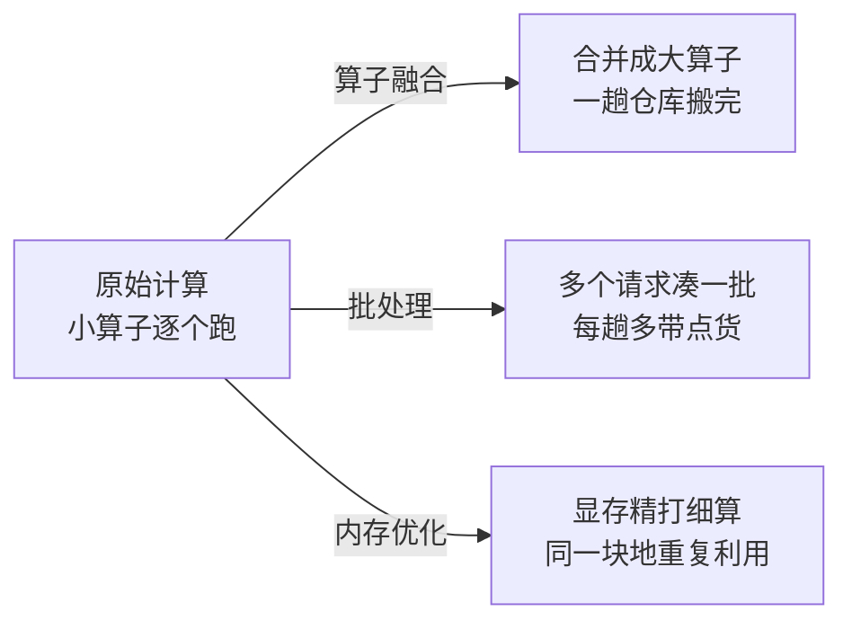

# 第 03 课　推理引擎与优化

前两课我们给模型办了护照（导出）、又让它减了肥（量化）。但部署工程师手里还有第三张牌：同样一个模型，换一套更聪明的"跑法"，速度就能差出几倍。这套更聪明的跑法，就是推理引擎的核心工作。这一课讲它最典型的三招——**算子融合、内存优化、批处理**，每招都遵循同一条主线：用什么代价，换什么收益。

---

## 一、为什么"会算"和"算得快"是两回事

先建立一个关键直觉：神经网络计算时，真正花时间的往往不是"乘加"本身，而是**搬数据**。

把 GPU 想象成一家超级餐厅：厨师（计算单元）手速极快，但每做一道菜，服务员都要先去仓库（显存）取食材、再送回后厨。来回搬运的时间远超炒菜本身。计算学名叫"计算密集"，搬运学名叫"访存"——大多数深度学习计算，时间都耗在取送食材的路上。

推理引擎的全部招式，几乎都在围绕一件事：**少跑几趟仓库，每趟多带点货。**

## 二、第一招：算子融合——把三道小菜炒成一锅

模型里到处是这样的结构：先做矩阵乘法，紧跟着加偏置，再来一个激活函数。看起来是三步，很多引擎会把"乘 + 加"融合成一次操作（这正是第 01 课 json 演示里线性层写法的由来），甚至把激活也一并卷进来。

为什么要融合？不融合时，每一步小操作都要：从显存读数据 → 计算 → 写回显存，再被下一步读走。就像做三道小菜，每道菜都单独去一趟仓库。融合后，数据读出来一次就在"手里"连续做完几步，最后才写回去——**仓库跑腿次数从 3 次降到 1 次。**

代价呢？融合后的"大算子"是为特定组合定制的，灵活度下降：换一种结构可能就没有现成的融合算子，还得回退到逐个跑。这就是"速度换灵活性"。

## 三、第二招：内存优化——显存里的收纳术

显存是部署中最紧缺的资源，内存优化有两条常见思路：

- **重复利用**：一个算子的输出被消费完，它占的显存立刻可以腾给别人用。像钟点房，退一间住一间，而不是全部客人都等最后一起退。引擎会提前分析"谁先用完谁先退"，规划出一张复用时间表。
- **按需分配**：与其按最长可能的输入预留一大块，不如实际来多少用多少，避免"整层楼包下来却只住一个人"。

这些事手工做极易出错（用错还没算完的数据就全盘皆输），所以交由推理引擎自动完成——你享受结果，引擎操心细节。

## 四、第三招：批处理——拼车出行

单个请求喂给模型，GPU 大量算力在"等数据"而不是"算数据"。批处理就是把多个请求凑成一批同时算：仓库一趟取回 8 个人的食材，而不是跑 8 趟。

单个人看，响应稍慢了（要等同伴凑齐）；整体看，餐厅单位时间能出的菜多了几倍——**吞吐量大幅上升，这就是批处理换来的收益，代价是单请求延迟略增。**

批越大吞吐越高、但延迟也越高、显存占用越多。这个"批次大小"就是部署时最常见的调节旋钮之一，没有标准答案，按业务对"快"和"省"的偏好来拧。下一课你会看到大模型场景下它还有一个更聪明的进化版。

## 五、配套演示怎么跑

`inference_engine_demo.py` 全程纯标准库，直接跑：

1. **算子融合段**：把"乘 + 加 + 激活"分别按"逐算子"和"融合"两种方式模拟，逐条打印两种做法的显存读写次数，数一数融合省了多少趟；
2. **内存复用段**：模拟一张算子时间表，展示同一块显存如何在算子之间接力复用；
3. **批处理段**：对比"逐个请求"与"拼批"的总操作步数，并试着调大批次看吞吐变化。

重点看每段末尾的"优化前后步数对比"——整章的交换逻辑都浓缩在这几行数字里。

## 想一想

1. 算子融合省时间的关键，是省了"计算"还是省了"数据搬运"？用餐厅的比喻说一遍。
2. 批次从 8 调到 64，哪三个数字会变？分别往哪个方向变？如果你在做聊天机器人（用户在乎响应快）和做夜间批量文档摘要（在乎总成本），分别往哪个方向拧？
3. 内存"重复利用"和量化（上一课）都在省显存，它们的省法有什么本质不同？能不能同时用？
4. 轻动手：运行 `inference_engine_demo.py`，把批处理段的批大小参数改成 2、4、16，记录三种情况下"总操作步数"和"最晚完成请求的等待轮数"，画出你观察到的交换关系。

## 小结

深度学习计算的时间大头常在显存搬运而非乘加本身，推理引擎的招式都围绕"少跑仓库、多带货"。
算子融合把连续小操作合并成一次显存往返，用灵活度换速度。
内存优化靠复用与按需分配精打细算，让同一块显存接待更多算子。
批处理拼车出行，吞吐量成倍上升，代价是单请求延迟略增、显存占用更高。
三招都指向同一条主线——速度、显存、精度、成本之间的交换；下一课看大模型把这套交换玩出了什么新花样。

2026 年 10 月
