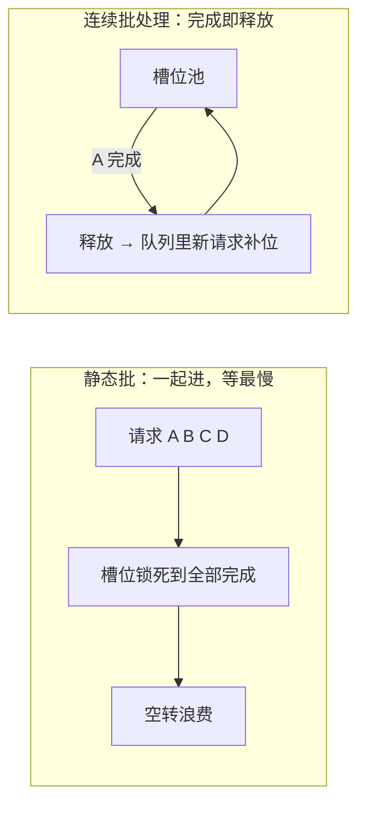

# 第 04 课　LLM 推理框架

上一课的招式（融合、复用、批处理）是通用推理引擎的基本功。但大语言模型一上场，情况变了：它一个字一个字往外蹦，还得随身带着越来越厚的"笔记本"。常规招式直接照搬会浪费得心疼。于是专门为大模型定制的推理框架登场了。这一课讲它们解决了什么，以及你今天就能在本机上手的那一个。

---

## 一、LLM 推理特殊在哪

回顾第 2 章讲过的推理过程，三个特点决定了它需要专门优化：

- **自回归生成**：一次只吐一个 token，吐完接回输入再吐下一个。写 500 字就是 500 次小计算，不是一次大计算。
- **KV Cache**：为避免每吐一个字都重算全部历史，模型把每层的中间结果记在"便签"上。对话越长，便签越厚——而且每个请求都有自己的一叠。
- **长度不定**：有人问"今天几号"，有人要写万字报告。请求之间的长度差异极大，资源很难提前规划。

便签本（KV Cache）是显存大户。粗略说，长对话下它吃掉的显存可以超过模型参数本身。**谁把便签管得好，谁就能服务更多人**——这是本课两条主技术的共同出发点。

## 二、连续批处理：谁吃完谁走，新客立刻入座

上一课的批处理有个隐藏缺陷：一批请求同时进、必须等**最长的那个**完成才能整体散伙。餐厅里这叫"整桌人不吃完不许翻台"——明明有两个人十分钟前就吃完了，座位空着，新客排着队，就是不让坐。



连续批处理（continuous batching）把座位池化管理：每生成一轮，谁写完了谁退槽，排队的新请求立刻补位。GPU 每一轮都是满负荷干活，几乎零空转。代价是调度逻辑复杂了——每轮都要决定"谁上谁下"，这道调度题正是配套演示里你来亲手模拟的。

## 三、PagedAttention：便签本按页管理

第二个麻烦：KV Cache 长度没法预知。传统做法按"最长可能"预留——像酒店把整个楼层包给一个旅行团，结果只来了三间房的人，其余全空着。显存就这么被浪费掉，还连带限制了能同时接待的请求总数。

vLLM 框架提出的 **PagedAttention**（分页注意力）借了操作系统管理内存的老智慧：把 KV Cache 切成固定大小的"页"（block），请求来了按需一页一页领，写完一页再领下一页，释放时页立刻归还池子。碎片没了，同一块显存能接待的并发数大幅上升——显存利用率上去了，吞吐自然跟着上去。

这一招**不加任何计算，纯靠"管"就省出真金白银的显存**，是 2026 年主流框架的标配思路（各家实现名字可能不同，道理相通）。

## 四、框架格局：一张地图

不写死版本号，按定位记四家（截至 2026 年的主流格局）：

| 框架 | 定位 | 一句话 |
|------|------|--------|
| vLLM | 高吞吐服务端 | PagedAttention 出身地，功能全 |
| TGI | 生产级服务器 | HuggingFace 系，工程化成熟 |
| TensorRT-LLM | 极致性能 | NVIDIA 官方，深度绑定其硬件 |
| Ollama | 本机最易用 | 一条命令跑开源模型，人人可试 |

交换主线依旧在场：框架越极致，配置越复杂、硬件绑定越深；Ollama 最好上手，性能调优空间也最小。**按"服务多少人、什么硬件、谁运维"来选，没有全能冠军。**

## 五、【Ollama 本机实操锚点】——今天就能动手的部分

这是本章人人可动手的落点：在你自己电脑上装好 Ollama，就能白嫖级地跑开源模型。以下命令在 Windows / macOS / Linux 通用（**本节为命令指引，撰写本讲义的环境未实跑**；装好即用，不依赖任何付费 API Key）：

```bash
# 1. 安装：官网 https://ollama.com 下载安装包，Windows 一路下一步即可
#    （Linux 可用一行脚本：curl -fsSL https://ollama.com/install.sh | sh）

# 2. 拉一个模型到本地（第一次会下载几 GB，耐心等）
ollama pull qwen3          # 示例名；模型名按官网模型库当前列表替换

# 3. 对话（装好即聊，退出输入 /bye）
ollama run qwen3

# 4. 顺手看看本地有哪些模型
ollama list
```

三件事请亲手做：装好、拉一个不太大的模型、跟它聊两句。你会发现"跑开源模型"没有任何魔法——这正是它打破神秘感的价值。配套的 `inference_framework_demo.py` 不替你跑 Ollama，但会模拟它的两条核心调度智慧；vLLM/TGI 等 Python 框架段会检测缺库并用中文提示跳过。

## 想一想

1. 四个请求长度是 2、5、3、4 个 token，静态批一轮一轮跑，有多少"槽位轮"被浪费？连续批处理呢？动手算算再跑演示对答案。
2. PagedAttention 和第 03 课的"显存复用"像不像？它们的区别是：一个管普通算子的中间结果，一个专管什么？
3. 你自己的电脑（或公司服务器）内存/显存多大？对照 Ollama 官网模型库，你觉得能拉多大的模型？这决定了你本机体验的边界。
4. 轻动手：跑通 `inference_framework_demo.py`，把请求数量或长度改一改，观察连续批处理相对静态批的节省比例怎么变——请求越参差不齐，节省越明显吗？

## 小结

LLM 推理三特殊性：逐 token 生成、KV Cache 吃显存、长度参差——专门框架由此而生。
连续批处理把批处理改成座位池：完成即释放、新请求补位，消灭空转等待。
PagedAttention 把 KV Cache 分页按需管理，不动计算纯靠"管"就省下大量显存。
框架按定位选：vLLM/TGI/TensorRT-LLM 各有战场，Ollama 是本机动手的首选入口。
模型能跑了，但它还只是个程序——下一课把它包成真正的服务，让别人也能用。

2026 年 10 月
