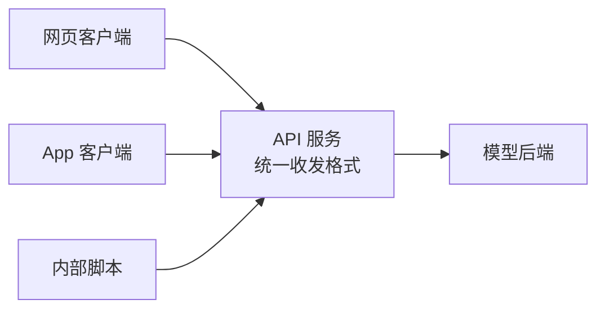

# 第 05 课　模型服务化

前四课我们把模型变得能搬、能瘦、跑得快。但在真实世界里，"我电脑上能跑"和"全公司都能用"之间还隔着最后一公里：模型得变成一个**随叫随到的服务**——别人不用知道你的电脑在哪、装了什么，发个请求就能拿到结果。这一课是本章收官，讲模型从"程序"变成"服务"要过的四道关。

---

## 一、第一道关：包一层 API——给后厨开个点菜窗口

模型本身只是个程序：你喂输入，它给输出。可总不能每个同事都跑来你的电脑上敲命令。标准做法是给它包一层 **HTTP API**：约定好"发什么格式、回什么格式"，任何人任何语言都能隔着网络调用。

就像餐厅：后厨（模型）再强，顾客也没法冲进去自己炒菜——得有菜单、有服务员、有个点菜的窗口。API 就是这个窗口。

这个窗口不需要重型装备：Python 标准库十几行就能起一个真服务（演示第 2 段会现场起一个、自己发请求、再关掉）。生产级服务只是把这层壳做得更结实：鉴权、日志、HTTPS——骨架一模一样。

## 二、第二道关：网关与路由——公司只对外公布一个总机号

模型一多，麻烦来了：对话模型一个地址、向量模型一个地址、大杯中杯各一个地址……客户端记不过来，哪个后端升级换代还得通知所有人改代码。

解法是加一层**网关**：对外只公布一个入口，它按请求内容把活分发给后面的各个模型后端。像公司总机：外界只记一个号码，接线的部门内部怎么调整、换人、扩编，客户完全无感。后端换模型、加副本，客户端一行代码不用改——这就是网关换来的"部署自由"。

## 三、第三道关：限流🚦——不是不信任用户，是保护所有人

模型服务有个和普通网站不同的特点：**贵**。每次调用都吃真金白银的算力和显存。如果没有限制，一个写失控的循环脚本就能把服务打垮——正常用户全部遭殃。

所以网关都带**限流**：给每个用户（或每个 Key）设配额，比如每分钟 60 次，超出就返回"请求太频繁，稍后再试"（HTTP 里约定俗成的 429 状态码）。像游乐园的热门项目：一次放进固定人数，其余的排队——不是针对谁，是保证项目不瘫痪、排到的人都能玩上。

实现不神秘：一个按用户记的**计数器**，窗口时间内数到上限就拒收。演示第 1 段就会真跑一个计数器，你会亲眼看到第 6 个请求被弹回来的样子。

## 四、第四道关：扩缩容——人多开窗口，人少收窗口

最后一关是容量规划：中午高峰期一个窗口排长队怎么办？临时加开窗口；下午没人了，收掉几个省人力。服务也一样：请求高峰**扩容**（多开几个模型副本）、低谷**缩容**（省机器钱），现代云平台能根据队列长度、延迟等指标自动做，叫**自动扩缩容**。

注意这条线怎么收束全章主线：扩容是**花钱买吞吐和稳定**，缩容是**用一点高峰风险换成本**。从第 01 课的格式转换，到量化、引擎优化、框架调度，再到今天的限流与扩缩容——部署工程师做的每件事，都是在速度、显存、精度、成本这四样之间找平衡点。

## 五、配套演示怎么跑

`model_serving_demo.py` 全程纯标准库，直接跑：

1. **网关路由 + 限流计数器**：路由表把请求分给不同"模型后端"，计数器放行前几个、弹回超限的；
2. **最小 HTTP API**：现场起一个真服务（自动挑空闲端口），自己给自己发两个请求验证，再干净关掉；
3. **扩缩容直觉**：模拟一波"高峰—回落"的流量，看副本数怎么随负载伸缩、总成本怎么变。

重点看三处输出：被限流那一刻的提示、HTTP 服务返回的 JSON、副本数跟随流量起伏的轨迹。

## 想一想

1. 为什么网关只对外公布一个地址？如果客户端直连每个模型后端，后端升级时会发生什么？
2. 限流配额该按"每用户"还是"每全局"算？两种各保护的是什么、牺牲的是什么？
3. 一家业务白天忙、夜里闲的公司，固定开 10 个副本和自动扩缩容，分别多花什么、少花什么？
4. 轻动手：跑 `model_serving_demo.py`，把限流上限从 5 改成 3，观察被拒的请求变成几个；再想想如果这是付费 API，限流值和"你卖的套餐"该是什么关系？

## 小结

服务化 = 给模型开一个随叫随到的窗口：API 定格式，网关管分发，限流保平安，扩缩容调成本。
网关让客户端只记一个总机号，换来后端随时升级替换的自由。
限流用计数器实现，挡住失控调用，保护的是所有正常用户。
扩缩容是全章主线的终点形态：一切优化最终都落在"花多少资源、买多少体验"的取舍上。
服务上线只是开始——谁来盯它的健康、谁给每次调用记账？下一章 AI 工程化与工具链，讲怎么让服务"可管理"。

2026 年 10 月
