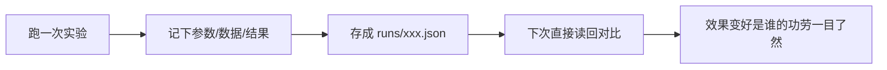

# 第 01 课　实验管理与追踪

上一章我们把模型部署出去了。但在那之前，你有没有想过一个问题：**这个模型到底是怎么来的？**

团队里经常出现这种对话："上周那个效果挺好的模型是谁跑的？""好像是老王……用的什么参数来着？""记不清了，重跑一遍吧。"重跑一遍，结果不一样了——因为没人记得当时的参数和数据。这节课就解决这个"谁来都说不清"的问题。

## 一、没有实验记录，项目大会出什么乱子

先看几个真实会发生的场景，你就明白为什么这课排在这里：

- **调参像抛硬币。** 你改了学习率，效果变好了一点。可你同时顺手还改了切分数据和随机种子——到底是哪个改动带来的提升？说不清，那就只能靠运气继续调。
- **三个月后无法复现。** 客户问："你们上季度投标演示用的那个模型，准确率多少？"你去翻聊天记录、翻旧代码，发现数据集已经被覆盖了，那个数字永远说不清了。
- **同事重复踩坑。** 小张试过某个思路，效果不行，放弃时没留记录。半年后小王又把同样的路走了一遍，浪费一整周。

生活化地类比一下：实验记录就是**做菜的配方**。同一道菜你随手做一次很好吃，如果不记下"盐几克、火多大、炖多久"，下次想复刻就只能靠感觉，客人吃得满意不满意全看天意。又像**实验室的记录本**——药品研发要是只靠脑子记哪次实验用了什么配比，那是要出安全事故的。

所以，实验追踪（Experiment Tracking）这件事，本质是**把"结果"和"它是怎么来的"绑在一起存档**。

## 二、一条实验记录该长什么样

核心要素就四样，缺一个，可复现性就断一环：

| 要素 | 记什么 | 例子 |
|------|--------|------|
| 参数 | 你定了哪些设置 | 学习率、切块大小、模型名 |
| 数据 | 用的是哪份哪版数据 | 数据文件指纹、条数 |
| 结果 | 跑出来效果如何 | 准确率、延迟、花费 |
| 时间与身份 | 什么时候、谁跑的、哪份代码 | 时间戳、备注 |

重点是**参数要记全**。很多时候效果差异的来源恰恰是那个你"觉得不重要所以没记"的设置。拿不准该不该记？记，又不会丢东西。

## 三、最小可用方案：一个 json 文件就够了

别急着装工具。我们先用纯 Python 标准库，把一条实验记录写进 json 文件——这已经是能用的实验追踪了：



配套的 `experiment_tracking_demo.py` 就是这么干的：模拟训练两次、各存一条记录、再读回来并排比较。它是纯标准库写的，你本机直接 `python experiment_tracking_demo.py` 就能跑。

等实验多了，它的短板也暴露：几十上百条记录摊在地上，想按指标排序、画趋势图就很吃力了。这时候上专业工具。

## 四、专业工具：MLflow 这一类

主流工具有 MLflow、Weights & Biases、TensorBoard 等。思路大同小异——你调几个函数，它帮你把参数、指标、产物（模型文件、图表）集中存好，还送你一个网页界面浏览比较：

```python
# 需先安装：pip install mlflow
import mlflow

with mlflow.start_run():
    mlflow.log_param("chunk_size", 200)      # 参数
    mlflow.log_metric("accuracy", 0.87)      # 结果
    mlflow.log_artifact("model.pkl")         # 产物文件
```

然后命令行敲 `mlflow ui`，浏览器打开就能看到每条实验的来龙去脉，哪次效果最好一目了然。

> 没装 mlflow 也完全没关系——本课配套脚本的核心逻辑（参数+数据+结果+时间戳存 json）就是这类工具的内核思想，只是工具帮你把存储、搜索、可视化做得更顺手。本章我们约定：真实工具段都标注"缺库可跳过"，最小示例永远能真跑。

注意一个 2026 年的常见口径：LLM 时代大家也用这类工具追踪"调用效果"（每次调模型的花费、延迟），W&B 和 LangSmith 类平台把这做成了独立赛道——后者我们留到第 04 课再聊。

## 五、把纪律刻进习惯

工具是外骨骼，纪律才是内核。给你三条现在就能用的：

1. **改任何设置前先想：这条改动我待会儿记吗？** 不记就别改。
2. **一次只改一个变量。** 否则结果变好变坏你都不知道该谢谁该怪谁。
3. **数据也要"版本化"。** 同一份数据改过之后，实验结果就不再可比——至少给数据文件记个改动时间或指纹。

这几条纪律看着朴素，它就是第 12 章实战项目和真实公司里 MLOps 团队的日常操作。工具（MLflow 这类）只是把纪律固化下来，让你不用靠自觉。

## 想一想

1. 你以前做过什么"没记录导致返工"的事？（不限于编程）当时的损失是什么？
2. 如果参数记了、数据没记，实验还能复现吗？为什么？
3. （动手）给 experiment_tracking_demo.py 再加一个参数（比如 temperature），看看记录文件里多出来的字段。
4. 两个实验各自记录了结果，A 的准确率高、B 的延迟低——你会怎么权衡？这类取舍该记在哪？

## 小结

实验追踪就是把每次实验的参数、数据、结果、时间绑在一起存档，核心诉求是可复现。一个 json 文件就是最小可用方案，专业工具（MLflow 类）在此基础上提供搜索比较和可视化。比工具更重要的是纪律：一次只改一个变量，改动必留痕。

到第 12 章第 04 课做监控 Dashboard 时，今天这条 json 记录会变成 Dashboard 上的一个数据点——先埋个伏笔。

模型有了实验记录，接下来它要走上生产：谁负责上线？出问题怎么退回上一版？下一课我们讲模型版本管理。

2026 年 10 月
