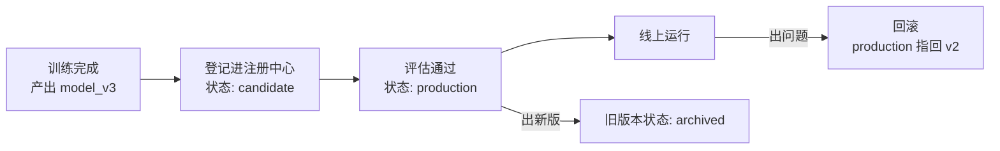

# 第 02 课　模型版本管理

上一课我们把实验记录好了，选出了那个效果最好的模型。新问题马上来了：**这个文件该发给谁？线上跑的到底是哪个版本？** 总不能在微信里发一个 `final_final_真的最终版.pkl` 吧。

这节课讲的就是：模型文件和它的配置，怎么像软件代码一样管起来；上线、出事、回退，每一步都清清楚楚。

## 一、没有版本管理，上线现场什么样

几个你迟早会撞上的场面：

- **说不出线上是啥。** 老板问："现在线上给用户做推荐的是哪个模型？"运维说是 3 号文件，算法说是上周那个，谁也不敢拍板。
- **出事退不回去。** 新版本上线十分钟，客服电话被打爆。想退回旧版？旧文件早被新文件覆盖了，硬盘里找不出来。
- **模型和配置对不上。** 模型是新的，阈值配置还是旧的，俩凑一起跑出奇怪的结果，查一晚上才发现是"版本错配"。

打个比方：模型版本管理就是**文件管理的"时间机器"**。Photoshop 每次保存都留一个历史版本，改砸了随手回到十分钟前；又像**药店的批号**——药品出了问题，凭批号能精确召回哪一批，其余批次照常卖。没有批号，就只能全架下架。

所以这课的核心动作有两个：**给模型打版本号**，以及**建一个"注册中心"记着哪个版本处于什么状态**。

## 二、三个概念：版本、注册中心、上线与回滚

模型版本管理不只是"把文件复制一份多起个名字"，它至少要管三样东西：

- **模型本体**：那个几百 MB 的权重文件。它没法像代码一样逐行看差异，所以按"整文件快照"管理，一个版本一份。
- **配套配置**：预处理参数、阈值、模型名、训练时的实验记录链接。模型离开配置跑不对，俩必须捆在一起登记。
- **版本状态**：这个版本现在处于什么阶段——`candidate`（候选）→ `production`（线上）→ `archived`（已退役）。谁在线上，就看哪条记录的状态是 production。

流程画出来是这样：



**回滚**是这套体系的价值所在：所谓回滚，就是把 production 标记从坏版本挪回好版本，坏版本降级留档。不是重新训练、不是从回收站翻文件，而是改一个指针。

## 三、最小可用方案：目录 + 清单 json

专业工具有 MLflow Model Registry、DVC、Hugging Face Hub 等，但它们的核心动作，用纯标准库也能演出来：

1. 建一个 `registry/` 目录，每个版本一个子目录（模型文件 + 配置一起放）；
2. 一份 `registry.json` 清单，记录每个版本的状态和登记时间；
3. "上线" = 把 production 标记写到某个版本上；"回滚" = 把标记挪回去。

配套的 `model_version_demo.py` 就是这么一套：注册两个版本 → 上线 v2 → 发现问题 → 一条命令回滚到 v1。全程临时目录操作，跑完自动清理，你直接 `python model_version_demo.py` 看全过程。

## 四、专业工具怎么做的

```python
# 需先安装：pip install mlflow
import mlflow

# 训练后把模型登记进注册中心，起个正式名字
mlflow.register_model("runs:/<run_id>/model", "qa_ranker")

# 评估通过后，把某个版本推上生产（就叫"上线"）
client = mlflow.tracking.MlflowClient()
client.transition_model_version_stage("qa_ranker", "3", "production")

# 出事回滚：把 production 指回旧版本，一行
client.transition_model_version_stage("qa_ranker", "2", "production")
```

你会发现动作和我们的最小示例一模一样：**登记 → 改状态 → 改回去**。工具额外帮你管了大文件的存储和多人协作的审批，思想没变。

> 没装 mlflow 照样能学：本课配套脚本就是注册中心的玩具实现，玩懂它，工具界面只是换个地方点同样的按钮。

## 五、和上一课接起来

还记得第 01 课实验记录里那句"模型从哪来"吗？版本登记时，就应该把**实验记录的链接**写进配置里。于是链条闭环了：实验记录告诉你"这个版本怎么来的"，版本注册中心告诉你"线上跑的是哪个"。出了问题，两条记录一对照，来龙去脉五分钟查清。

这套"上线-回滚"的功夫，在第 12 章第 04 课做监控 Dashboard 时会用到：Dashboard 上要显示"当前生产版本"，数据就来自这样的注册中心。

## 想一想

1. 只用网盘"复制文件多起名字"管理模型，会漏掉上面讲的哪一样东西？
2. （动手）给 model_version_demo.py 加一个 v3，注册后把 production 指给它，看看清单文件怎么变。
3. 回滚之后，那个出问题的版本应该删除吗？为什么留档更好？
4. 模型文件和配置文件，为什么强调"捆在一起"登记？分开管会出什么事？

## 小结

模型版本管理 = 模型文件 + 配置 + 状态一起按版本登记；注册中心是一本账，记着每个版本处于候选、生产还是退役。上线是改状态，回滚是把指针挪回去，不是重新训练。MLflow Model Registry 这类工具只是把这套账本做得更好用。

线上跑起来了，那它跑得好不好、有没有出事，谁来盯？下一课讲监控与评估。

2026 年 10 月
