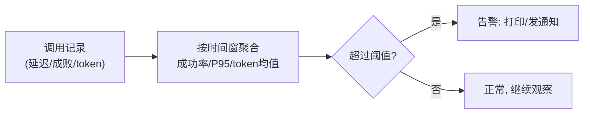

# 第 03 课　监控与评估

模型上线了，前两课的活儿都干得漂亮。然后呢？然后系统就开始"自己过日子"了：用户在涨、问题在变、依赖的服务在抖。**你不在场的时候，谁来告诉你系统还健康吗？**

这就是监控的活儿。先看没有它会怎样。

## 一、没有监控，出事全靠用户举报

几个经典场面：

- **系统挂了半小时，你刷手机才知道。** 用户在群里炸锅了，你才手忙脚乱去登服务器。
- **回答悄悄变烂，没人发现。** 三个月来用户的问题从"报销流程"漂移到了"AI 写周报"，知识库没更新，回答质量一点点下滑——没有报警，因为系统没"坏"，只是"不灵了"。
- **账单突然爆炸。** 某个用户写了个脚本疯狂调用，token 消耗涨了 50 倍，月底账单见。

生活化类比：监控就是**汽车的仪表盘**。你不需要实时盯着发动机转速，仪表盘替你盯，油量低了亮黄灯、水温高了亮红灯——亮灯就是告警，其余时候安心开车。又像**体检报告**：各项指标后面印着参考范围，超出范围那行会被标红，医生看标红项就够了。

所以线上监控拆开就三件事：**采集指标 → 和阈值比 → 超了就喊人**。

## 二、盯哪些指标

AI 应用和普通 Web 服务有一点不同：除了延迟、成功率这些通用指标，还多了 token 这个"钱"维度。

| 指标 | 说明 | 为什么盯 |
|------|------|----------|
| 延迟 | 一次调用耗时，看 P50/P95 | 用户体感；P95 抓住"最惨的那批人" |
| 成功率 | 请求成功比例 | 最直观的健康线 |
| token 用量 | 每次调用的输入输出 token | 直接关联成本，也是模型负载信号 |

P50/P95 解释一下：把 100 次调用的耗时排队，第 50 名的值就是 P50（一半人比它快），第 95 名是 P95（95% 的人比它快）。平均数会被少数极端值骗，P95 更能反映"最差体验"。

还有一个 AI 特有的坑：**效果衰退**。模型没改、代码没改，但用户的问题在漂移，知识库过期了，回答就在悄悄变差。运行指标能间接闻到味道——成功率下降、用户重复提问变多——但确认它，靠的是**评估**：定期拿一组测试题考模型，给效果打分。**监控是线上值班医生，评估是定期体检**，两个词经常一起出现（所以本课叫"监控与评估"），但一个盯运行、一个测效果。

## 三、最小可用方案：一批调用记录的聚合

不需要一开始就上监控系统。日志文件里的一批调用记录，用纯标准库聚合一下，就是监控的雏形：

配套的 `monitoring_demo.py` 模拟了 200 条调用记录（前 150 条正常，后 50 条故意"变差"），聚合出两段指标、跑阈值告警。你会亲眼看到第二段触发红灯——那就是"衰退被发现了"。纯标准库，直接 `python monitoring_demo.py` 跑。

这页聚合输出别小看：到了**第 12 章第 04 课做监控 Dashboard** 时，图表背后就是这个东西，只是换成了自动刷新 + 画成图。

## 四、专业工具与告警的艺术

真实系统里，Prometheus/Grafana 负责采集和画图，告警走邮件、钉钉、Slack。工具会变，但告警设计的三条经验不变：

1. **别狼来了。** 阈值定太敏感，天天误报，大家就把告警静音了——最危险的告警是被忽视的告警。
2. **告警要带上下文。**"成功率 86% < 95%（最近 10 分钟，/chat 接口）"比"出事了"有用得多。
3. **红灯分两级。**"服务挂了要立即响应"和"延迟偏高今天看看"必须是不同的响铃方式。

MLflow、LangSmith 这类平台（第 01 课提过）也内置了监控面板，思路一样：把记录集中起来，画出来，超线就喊人。

## 想一想

1. 如果只让你盯一个指标，你选成功率还是 P95 延迟？说说你的场景理由。
2. 为什么平均延迟会"骗人"？想一个平均值看起来正常、实际很糟的分布。
3. （动手）把 monitoring_demo.py 里的成功率阈值从 0.95 改成 0.80，重跑看看告警少了什么、可能漏掉什么。
4. 用户问题漂移导致回答变差，运行指标不一定报警。你有什么办法能更早发现这种"没坏但不灵"？

## 小结

线上监控三件事：采集调用记录、聚合关键指标（成功率/延迟分位/token 均值）、超阈值就告警。监控盯运行健康，评估测回答效果，效果衰退要靠两者配合才抓得住。告警要带上下文、要防狼来了。这页聚合输出就是第 12 章监控 Dashboard 的雏形。

红灯亮了，你只知道"有问题"，还不知道"哪一步有问题"。下一课可观测性，把一次调用拆开逐段看。

2026 年 10 月
