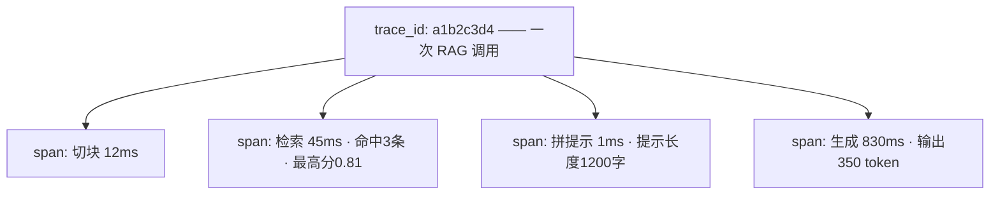

# 第 04 课　AI 可观测性

上一课的监控红灯亮了："P95 延迟 2400ms，超过阈值"。然后呢？延迟高是慢在检索、慢在拼提示词，还是慢在调模型？监控答不上来——**监控告诉你"病了"，这节课教你"病灶在哪"**。

这就是可观测性（Observability）。打个比方：监控像体温计，只告诉你发烧了；可观测性像 CT，能指出发炎的位置在哪。它是大模型应用时代最有特色的一课。

## 一、一个 trace_id，看穿一次调用的全过程

先生活化类比：**快递的物流单号**。你下单后拿到一串单号，包裹每到一个中转站就扫一次码，"已揽收 → 到达武汉转运中心 → 派送中"。包裹丢了或慢了，你不用猜，点开单号，哪一站卡住一目了然。

一次 AI 调用也一样，被拆成一串步骤，每步都记录：

- **trace（追踪）**：一次完整调用，从收到请求到返回答案，给一个全局唯一的 **trace_id**（就是快递单号）；
- **span（跨度）**：调用里的一个步骤（切块、检索、拼提示、生成），记录它什么时候开始、跑了多久、有什么属性（检索命中几条、生成花了多少 token）。

有了这套东西，红灯不再是一句"P95 高了"，而是能点开任意一次慢调用，看到时间都花在哪一步。

## 二、AI 应用要看什么

普通 Web 服务也做链路追踪，但 AI 应用多了几个特色关注点：



- **token 都花在哪了**：提示词比想象的长？检索塞进去太多无关块？span 里的属性让 token 消耗可见，直接省钱。
- **检索质量**：命中 0 条还硬生成，答案当然胡说——"检索命中数"是 RAG 应用最该记录的属性之一。
- **报错定位**：报错挂在哪个 span 上，一眼定位，不用从头读代码。

这套理念对应的工具是 LangSmith、Langfuse 等"LLM 可观测平台"：把每次调用的 trace 存下来，网页上能展开每一步、看每一步的输入输出。第 05 章 mini_rag 里我们说过"每一步都留现场"，说的就是它。

## 三、最小可用方案：给 mini_rag 加调用日志

还记得第 05 章 mini_rag.py 打印的那四段"测压报告"吗？可观测性就是它的工程化版本：**每一步一个 span、全局一个 trace_id、统一格式存档**。

配套的 `observability_demo.py` 是"给 mini_rag 加调用日志"的可跑版：复刻了迷你 RAG 流程（切块→检索→拼提示→离线生成），每步计时并记录属性，一次完整的调用写成一行 json 存进 `traces.jsonl`，最后打印整棵调用树。里面还故意安排了一次"检索扑空"的调用，你可以看到日志怎么帮你定位"答案胡说的原因是没检索到东西"。

这文件是纯标准库的，直接 `python observability_demo.py` 跑。**`traces.jsonl` 这个文件，就是第 12 章第 04 课监控 Dashboard 上"链路详情"面板的数据源**——Dashboard 只是把它查询出来、展开成图。

```python
# 需先安装：pip install langsmith
# 真实平台把同样的 span 概念接入云端，网页展开每一步
```

> 没装 LangSmith 照样能学：概念只有三个——trace_id、span、属性。本课脚本就是它们的玩具实现，玩懂了换任何平台都是"换个地方写字段"。

## 四、养成三个习惯

1. **入口先发 trace_id。** 请求一进来就生成，之后每条日志都带上它，排查时 grep 一下全程打包带走。
2. **关键步骤都计时。** 不确定哪里慢？先加计时再讨论，别凭感觉吵架。
3. **属性里塞"以后你会想知道"的信息。** 检索命中数、提示长度、token 数——现在多写一行，将来少查一夜。

## 想一想

1. 监控和可观测性的分工，用一句话说清各自回答什么问题。
2. （动手）跑 observability_demo.py，找到那次"检索扑空"的调用，说说日志里哪些字段让你确定是检索的锅。
3. 如果只在"生成"这一步记录 span，其他步骤不记，会遇到什么排查困境？
4. 提示词里塞了 10 个检索块，输出 token 才 50——从省成本角度，你该优化哪一头？日志里哪个字段给了你证据？

## 小结

可观测性 = 给每次调用发 trace_id、把流程拆成带计时的 span、把关键信息记成属性存档。它把监控的红灯变成可定位的病灶，token 花在哪、慢在哪、错在哪，点开 trace 就有答案。LangSmith 类平台是这套理念的商业实现。

慢和错都能定位了，还剩最后一问：回答**内容**好不好，怎么量？主观的东西也要打分——下一课 LLM 评测体系。

2026 年 10 月
