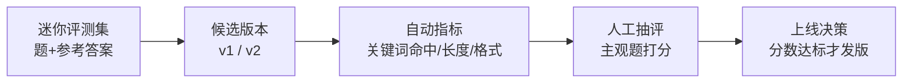

# 第 05 课　LLM 评测体系

前面四课把"运行"管起来了：实验有记录、版本能回滚、指标会告警、链路能追踪。但还剩最后一个问题，也是大模型应用最特别的一个问题：**回答得好不好，怎么量？**

延迟有毫秒、成功率有百分比，可"这个回答写得怎么样"是主观的。这节课就讲怎么给主观的东西建立评分体系。

## 一、凭什么说新版本"更好"

先看两个反面教材：

- **"我觉得比上个版本好。"** 谁觉得？三句聊天记录的样本？改了提示词的作者本人？凭感觉做决定，等于把产品路线交给运气。
- **"我测了，都挺好。"** 你测的是你自己会问的问题。真实用户会问"外星人什么时候入侵地球"、会把一句话拆成三行问——没测过的场景，上线才见分晓。

生活化类比：**学校考试**。选择题机器批卷（客观、快、便宜），作文老师批卷（主观、慢、准）。一套完整的评测体系就是两者搭配，而不是二选一。又像**体操比赛打分**：难度分有客观规则，艺术分靠评委，还要去掉最高分最低分防止个人偏好——主观，不代表不能有纪律。

LLM 评测的核心思路和这两件事一样：**固定考题（评测集）→ 自动指标粗筛 → 人工评估把关 → 用分数做决定。**

## 二、评测集：先固定考卷

一切的前提是一份**迷你评测集**：几十道有代表性的题 + 每题的参考答案。它的三个要求：

- **覆盖典型场景**：简单题、绕弯子的题、知识库里没有的题（考察它会不会瞎编）都要有；
- **带参考答案**：没有标准答案，机器指标没法算；
- **保持稳定**：同一份考卷才能比较不同版本——今天换卷子，分数就不可比。

这和第 01 课"数据要版本化"是一个道理：**评测集本身也是要版本管理的资产。**

## 三、自动指标：机器批的选择题

对每道题的模型回答，用规则算几个分：

- **关键词命中**：参考答案里的关键词（如"5 个工作日"）回答里有没有。粗糙但能抓"答非所问"。
- **长度**：太短多半没说清，太长浪费 token 还淹没重点。
- **格式**：该带数字的带没带数字、该分点的有没有分点。

配套的 `llm_eval_demo.py` 就在一套 3 题的迷你评测集上，给两个候选版本逐项打分。纯标准库，直接 `python llm_eval_demo.py`。

## 四、人工评估：老师批的作文

自动指标的天花板很明显："回答流畅吗？语气对吗？有没有狡猾的事实错误？"——规则写不出来。这些只能**人来打分**：

- 定一个简单量表（比如 1~5 分：1 胡说 / 3 能用 / 5 惊艳），评分标准写下来，别让每个人自由发挥；
- 抽评而不是全评，控制成本；
- 有条件时上"模型当评委"（用一个更强的模型给回答打分），2026 年这已是主流辅助手段——但它也要抽人工复核，否则评委自己犯错没人知道。

关键动作是**对照**：自动分和人工分摆在一起看。自动分排的序和人工分排的序大致一致，说明指标有效；差得远，就该修指标。本课脚本里就做了这个对照，你会看到两版回答"机器怎么想、人怎么想"的逐题对比。

这套"评测集+自动指标+人工对照"的输出，到了**第 12 章第 04 课监控 Dashboard** 就是"质量趋势"面板的数据源：每次发版前跑一遍评测，分数画成折线，效果衰退一眼可见——五章四课的伏笔在这里合龙。

## 五、上线决策

评测的终点不是分数，是**决定**：分数达标才发版，不达标打回。呼应第 02 课：candidate → 评测通过 → production，状态机的"评估通过"这一步，靠的就是今天这套体系。到这里，第 11 章五课串成了一个环：**实验记录 → 版本注册 → 监控告警 → 链路追踪 → 评测把关**。

## 想一想

1. 如果只允许保留一样：评测集、自动指标、人工评估，你留哪个？代价是什么？
2. 自动指标和人工分的排序出现严重分歧，先怀疑哪一方？为什么？
3. （动手）给 llm_eval_demo.py 的评测集加一道"知识库里没有"的题（比如问天气），再想想好回答应该长什么样（提示：承认不知道比瞎编好）。
4. "模型当评委"省人力，但评委可能偏心哪类回答？怎么发现它偏心？

## 小结

主观回答也要有纪律地打分：先固定评测集（带参考答案、保持版本稳定），再用自动指标（关键词/长度/格式）低成本粗筛，关键的主观维度交给人工量表，并定期对照两者排序是否一致。分数最终服务决策：达标才上线。第 05 章 mini_rag 的"留现场"习惯，到这里升级成了完整的质量把关。

第 11 章到此收束：实验追踪、版本管理、监控、可观测性、评测，五件事合成一套工程纪律。下一章第 12 章实战项目，我们就带着这套纪律，把 demo 做成真正能上线、能运维、能持续改进的完整系统。

2026 年 10 月
