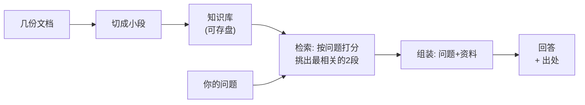

# 第 01 课　本地知识库 RAG

从这节课开始，我们进入实战。第一个项目不追求炫技，而是把你已经学过的零件——文档切分、检索、组装提示词——组装成一个真正能日常用的小系统：你把几份文档喂给它，以后有问题直接问，它基于你的文档回答，还会告诉你答案出自哪份材料哪一段。

---

## 一、先把这个项目说清楚

你肯定遇到过这种场景：公司的请假制度、报销规则散落在几份 PDF 和网页里，每次想确认"年假到底有几天"，都得翻半天。做一个"本地知识库"就是解决这个的——把文档喂进去，以后张口就问。

第 5 章我们写的 mini_rag 已经能一问一答了，但它只有十几行，是个"能跑的原理演示"。真实项目要再往前走三步：

- **能入库**：文档一份份喂进来，存得住，不是每次运行都现切现丢
- **能检索**：问一个问题，先找出最相关的几段，而不是把所有文档都塞给模型
- **能交代出处**：每个答案都注明"出自哪份文档第几段"，让你能自己核实

第三步最要紧。大模型会一本正经地编答案，出处就是给你的"验货单"——它说的每句话你都能翻回原文对一对。这就像一个靠谱的图书管理员：他不但告诉你答案，还顺手把书递给你，指给你看是第几页。

---

## 二、整个系统长什么样



左边是"入库"，只做一次；右边是"问答"，每次提问都走一遍。这个结构就是所有 RAG 系统的骨架——将来你见到多复杂的 RAG 产品，拆开看还是这两条线。

---

## 三、配套代码怎么读

打开本课目录的 `local_kb_rag.py`（不到两百行，纯标准库，不需要装任何东西），代码按上面这张图分成五块：

1. **DOCS**：内置了三份示例文档（员工手册、报销制度、IT 账号指南），代替"你的 txt 文件"。真实使用时换成读你自己的文件就行。
2. **build_kb()**：按段落把文档切成片段，每段登记好"来自哪份文档、第几段"——出处信息就是在入库时挂上去的。
3. **search()**：检索打分。问题里出现过的字词，在某段里出现得越多，这段就越相关。这是最朴素的做法，但思路和大模型时代的向量检索是一致的：都是"找出和问题最像的那几段"，只是相似度算得糙一点。够用，而且零依赖。
4. **extract_answer() / ask_real_llm()**：拿到相关段落之后，怎么变成一句回答。`ask_real_llm()` 就是接真实大模型的位置——把"资料 + 问题"交给模型组织语言。这个函数需要 API Key 才能跑，**本课未实跑**；你配好环境变量后可以用它替换兜底方案。没配 Key 也不影响学习：程序会自动退回到"抽取式回答"，直接把最相关的那段原文端给你。
5. **demo() / main()**：命令行入口。

## 四、跑起来

直接运行，看内置演示（入库 → 检索 → 回答全流程）：

```
python local_kb_rag.py
```

也可以单独提问：

```
python local_kb_rag.py ask "年假有几天"
```

你会看到类似这样的输出：程序先报告入库了几个片段，然后对每个问题列出"命中的段落和相关度"，最后给出带出处的回答——形如"根据《员工手册》第 2 段：年假：入职满一年每年 5 天……"。这个"能验货"的答案，就是我们这一课的交付物。

代码里还有一个小细节值得看：知识库会以 JSON 形式存到系统临时目录，下次运行时如果存在就加载——这就是"入库"的持久化。真实项目里，你会换成向量数据库（第 7、8 章学的 FAISS、Chroma 就派上用场了）。

---

## 五、真实项目里还差什么

诚实地说，这个精简版离生产还有距离，差的地方恰好是你前面学过的：

- **检索精度**：我们用字词重合度打分，问"休假"就搜不到写着"年假"的段落。第 5 章的 Embedding 检索按"意思相近"匹配，生产系统都用它。
- **回答质量**：抽取式兜底只会"抄原文"，真实体验要靠模型把资料揉成一句通顺的话——这就是 `ask_real_llm()` 的活。
- **规模**：几十份文档没问题，几千份就要上向量数据库和更讲究的切分策略（第 5 章讲过 chunk 大小的取舍）。

先把骨架跑通，再逐块换上更好的零件——这是做项目的正确顺序，别一上来就追求完美。

---

## 写个 README

从这一课开始养成习惯：每个项目配一个 README，回答三个问题——**这是干什么的、怎么装、怎么跑**。本课目录里的 `README.md` 就是一个现成的示范，你可以照着它给后面每课的项目都写一份。别小看这个动作：能用人话把项目讲清楚，才算真懂了；将来面试，README 就是你作品集的门面。

---

## 学完第 14 章回来加的扩展环节

现在它是个命令行工具。学完第 14 章的 Streamlit 后，回到这里加一个网页问答界面：左边选文档，右边输入框提问，答案下方挂出处。同一套 `build_kb` / `search` 函数直接复用，你会发现界面只是给核心逻辑"穿衣服"。

---

## 想一想

1. 如果把整份文档不切分、直接全部塞给模型回答，会有什么问题？（提示：想想第 5 章讲的上下文长度和"大海捞针"）
2. 出处信息是在哪一步挂到答案上的？如果把 `build_kb()` 里的"第几段"删掉，系统还能正常回答吗？代价是什么？
3. 用字词重合度打分，构造一个具体例子：什么样的问题会检索失败？怎么改问法就能搜到？
4. （动手）给 `DOCS` 里加一份你自己写的文档（比如"考勤制度"），重新运行，然后问一个只有这份新文档能答的问题，看看检索和出处对不对。

---

## 小结

- RAG 系统的骨架就两条线：入库（切分、登记出处、存盘）和问答（检索、组装、带出处回答）。
- 出处是给用户的"验货单"，能对回原文的答案才可信，这是 RAG 对抗幻觉的关键设计。
- 精简版用字词重合度做检索、抽取原文做兜底回答；换上 Embedding 检索和真实模型，就逼近生产形态——两个升级挂点都已在代码里留好。
- 每个项目配一份 README：干什么、怎么装、怎么跑。

下节课我们给这个系统换一个更聪明的用法：不光被动地等你提问，还能自己拆任务、调工具、一步步把事办完——那就是 Agent。

---

2026 年 10 月
