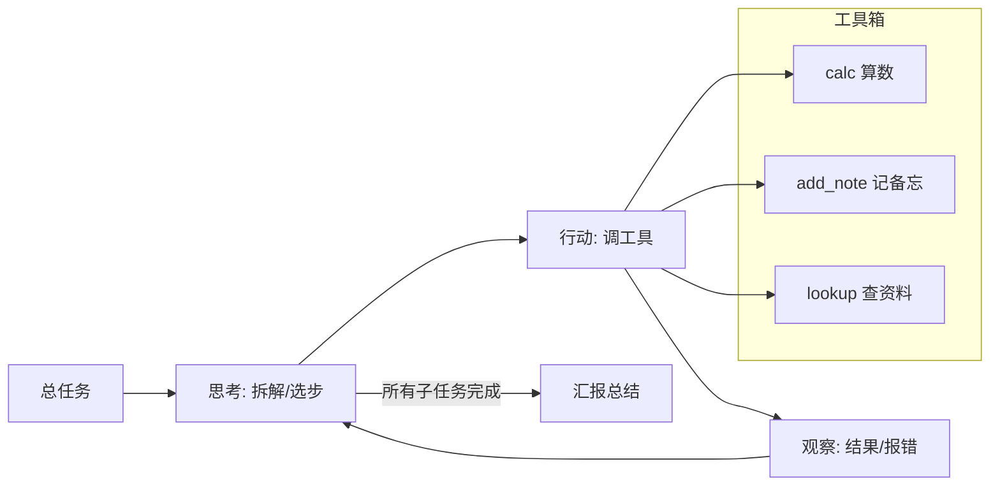

# 第 02 课　Agent 任务执行系统

上一课的知识库是个"有问必答的图书管理员"——你问它才动。这一课我们升级成"会自己干活的实习生"：给它一个目标，它自己想清楚分几步、每步用哪个工具，一步步办完，中途还会根据观察到的结果调整计划。

---

## 一、从"回答问题"到"办完事情"

回顾第 6 章我们写过的最简 Agent 骨架，它的心跳只有一个循环：**思考 → 行动 → 观察**。

- **思考**：看看现在的目标和已知信息，决定下一步干什么
- **行动**：动手调一个工具（算一笔账、查一次资料、记一条备忘）
- **观察**：把工具返回的结果消化掉，再进入下一轮思考

普通程序是"照清单办事"——所有步骤都是人预先写死的；Agent 是"看情况办事"——步骤是它根据观察临时决定的。这就像装修：照着全包合同推进的项目经理是普通程序，而那个每做完一步都去看现场、发现问题就改方案的工头，更像 Agent。

本课的实战目标：写一个命令行 Agent，给它一个总任务，它自己拆解成子任务、选工具执行、逐步办完，最后向你汇报。

---

## 二、系统的骨架



三个环节里，"行动"依赖工具箱，"观察"依赖工具返回值，"思考"是大脑。真实项目里大脑是 LLM；我们这个零依赖版用**规则模拟大脑**——按固定策略挑下一步。循环本身与真实 Agent 一模一样，等你接入 LLM，只需把"思考"那一步换成模型调用，其他代码原封不动。

---

## 三、配套代码怎么读

打开 `agent_runner.py`（约 160 行，纯标准库）：

1. **TOOLBOX**：三个工具，每个都是一个普通函数——注册表是 `{"工具名": (函数, 一句话说明)}`。给工具写清楚说明很重要：真实 Agent 靠这段描述决定用哪个工具（第 6 章 07 课讲过的 Tool Use 要点）。
2. **plan()**：把总任务拆成子任务清单。这里按"任务文本里出现哪些关键词"拆——真实 Agent 里这一步由 LLM 一次性输出 JSON 计划（第 3 章 Structured Output 正是干这个的）。
3. **choose_tool() / extract_arg()**：一个"思考-行动-观察"节拍——先按规则给子任务挑工具，再从子任务文本里抠出要传给工具的参数。
4. **run()**：主循环——逐个子任务完成"思考-行动-观察"，观察结果记进 history（Agent 的短期记忆），全部完成后生成汇报。
5. **demo() / main()**：命令行入口。

## 四、跑起来

```
python agent_runner.py
```

你会看到 Agent 的工作流水账：它接到"查一下差旅住宿标准，算一下 400*3 是多少，把合计 1200 记入备忘"后，先拆成"查资料 → 算数 → 记备忘"三步，每步打印一行"思考"、一行"行动"、一行"观察"，最后交出一份总结。你可以再跑 `python agent_runner.py "查一下VPN申请流程"` 看它换一条执行路径——**同一套循环，路径随任务而变**，这就是 Agent 和普通脚本的分水岭。

代码里值得留意：每一步的观察结果都保留在 `history` 里，后面的思考能引用前面的成果。这个"滚动上下文"就是 Agent 的短期记忆（第 6 章 02 课的 Memory 组件在生产版里就干这个）。

---

## 五、离"真 Agent"还差哪几块

对照第 6 章学的框架盘点，这个精简版还有三处要升级：

- **大脑**：规则拆解换成 LLM 输出计划 JSON，还支持失败重试和改道
- **工具**：三个内置函数换成真实 API、数据库、第 12.5 课那样的 MCP 平台
- **记忆**：内存里的 history 换成可持久化的记忆库，任务跨天也能续

第 12 章后面的课会把工具箱交给 MCP 平台，把协作交给 Multi-Agent——这一课的循环是它们共同的心脏。

---

## 学完第 14 章回来加的扩展环节

旧版教程在这里塞了 FastAPI 加 WebSocket 的实时任务页面——那是第 14 章的技能，现在不写。学完 14 章回来：用 FastAPI 把 `run()` 包成接口，前端提交总任务、页面实时刷新 Agent 的每一步"思考-行动-观察"。核心逻辑今天已经就位，到时候只是穿衣服。

---

## 想一想

1. 本课 Agent 的"思考"是规则模拟的。找一段你自己的任务流程，说说规则版会在哪一步露馅（想不出分支或选错工具），换成 LLM 后为什么能解决？
2. `history` 越滚越长会怎样？如果任务要执行 100 步，全部历史都塞给"大脑"合理吗？想到什么办法控制它？（提示：回忆第 6 章记忆系统的分层）
3. 工具描述写得含糊，Agent 会发生什么？动手改坏 `TOOLBOX` 里某个工具的说明，跑一遍看它还会不会选对工具。
4. （动手）给工具箱加一个新工具 `ask_kb`——直接调用第 01 课 `local_kb_rag.py` 里的 `search()` 函数查知识库，让 Agent 能"办完事顺便引用制度原文"。

---

## 小结

- Agent 的心脏是"思考-行动-观察"循环：看情况决定下一步，而不是照人写死的清单走。
- 工具 = 普通函数 + 一句清楚的说明；注册表让 Agent 能挑工具，说明写得好坏直接影响它选得对不对。
- 滚动的 history 就是 Agent 的短期记忆，前面的观察会成为后面思考的依据。
- 精简版用规则模拟大脑零依赖真跑；换上 LLM、真工具、持久记忆，就是生产级 Agent 的三块升级。

下一课我们把这个循环用到最常见的场景：客服。同一个"理解-查资料-回复"的套路，怎么做出一个口吻稳定、有问必答的客服机器人？

---

2026 年 10 月
