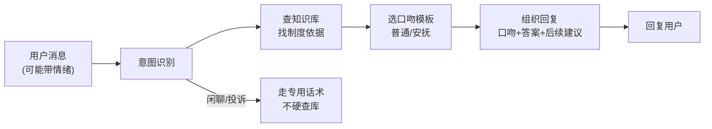

# 第 03 课　智能客服机器人

前两课我们做了"能答出处的知识库"和"会自己干活的 Agent"。这一课把它们捏到一起，做成最常见的 AI 落地形态——智能客服：用户随口一句话（可能还带着情绪），它能听懂意图、查到制度、按固定口吻礼貌回复。

---

## 一、客服机器人和聊天机器人差在哪

很多人以为客服机器人就是个"会聊天的模型"，其实差得远。直接把用户问题丢给大模型，会出三个事故：

- **瞎答**：模型不知道你们公司的制度，按常识编一个"年假 15 天"
- **口吻漂移**：一会儿像客服、一会儿像百科全书、一会儿太随意
- **兜不住情绪**：用户火气上来了，它还在慢条斯理讲道理

合格的客服机器人是"模型 + 规矩"的组合拳：先猜用户想干什么（意图），再去知识库查依据（检索），最后按写好的口吻模板组织回复（话术）。大模型只负责最后"把话说得通顺"这一步——就像餐厅服务员：他不自己发明菜，后厨（知识库）出什么菜他端什么，端法（口吻）受过培训。让服务员在厨房里自由发挥，客人吃出什么就不好说了。

---

## 二、一次客服会话的完整流水线



注意左边那条岔路：不是每句话都值得查库。用户只是打招呼、或者已经怒到要投诉，硬答制度反而火上浇油——意图识别先把这类消息分流到专用话术。会"该查才查"是客服机器人的重要一课。

---

## 三、配套代码怎么读

打开 `customer_service.py`（约 160 行，纯标准库）：

1. **KB**：复用第 01 课的思路，内置几条客服最常被问的制度。
2. **detect_intent()**：意图识别。按关键词把消息分成四类：问候、投诉（安抚优先）、咨询（去查库）、其他。
3. **TONE**：口吻模板字典。每种意图配了固定的开场白和收尾话术——这就是"口吻稳定"的秘密：不管模型多随机，骨架话术是人定的。
4. **answer()**：主线。咨询类先查库，查到就按模板拼回复；查无依据或超出范围就老实转人工，绝不硬编。
5. **chat() / main()**：命令行对话循环，输入 `q` 退出。

## 四、跑起来

```
python customer_service.py
```

试试这三种消息，感受流水线的分流：

- `在吗` → 走问候话术，不查库
- `差旅住宿标准是多少` → 查库 + 制度答案 + 出处
- `你们这系统也太烂了吧` → 先安抚再引导，最后才谈解决方案

也可以一次演示：`python customer_service.py demo`，程序自动轮播这三类对话。留意"查不到"的情况——问一个库里没有的问题，它会承认查不到并提议转人工。**诚实地说不知道，比自信地胡编强一万倍**，这是客服产品的生命线，也是我们第 01 课讲"出处验货"的延续。

---

## 五、接真实模型的挂点

代码里 `polish_with_llm()` 是升级挂点：把"检索到的制度 + 口吻模板"一起交给模型，让它把答案说得更有温度。模板是骨架、模型是肉——不是让模型自由发挥。这个函数需要 API Key，**本课未实跑**；没有 Key 时程序用纯模板回复，一样能用。上线前还应该加：敏感词过滤、话术合规审核、人工抽检——口吻可以靠模板，责任必须有人兜。

---

## 学完第 14 章回来加的扩展环节

现在是命令行对话。学完第 14 章回来：用 Streamlit 给它穿一个聊天窗口界面，用户消息靠左、机器人回复靠右，加上"转人工"按钮；老版本教程里的网页实现，到时候半小时就能加上。

---

## 想一想

1. 为什么"查知识库"这一步必须在大模型回答之前，而不是让模型先自由回答再检查？结合第 01 课的"验货单"说说你的理解。
2. `detect_intent()` 用关键词分流，构造一句会**分错类**的用户消息（比如带着反话的咨询），想想真实产品为什么要用模型做意图识别。
3. 用户问"我可以把年假折成钱吗"，知识库里只有年假天数没有折算规则。合格的回复应该长什么样？动手改 `KB` 或模板，让它这样回答。
4. （动手）给 `TONE` 加一种"售后工单"意图：识别"维修/报修/故障"等词，回复固定话术"已为您创建工单"——体会"加一个意图要动哪几处"。

---

## 小结

- 客服机器人 = 意图识别 + 知识库检索 + 口吻模板，模型只负责把答案说通顺，不负责发明答案。
- 不是每句话都查库：问候、投诉走专用话术，"该查才查"是体验和成本的双重考量。
- 查不到就承认查不到并转人工——诚实的兜底比自信的胡编重要一万倍。
- 口吻稳定的秘密在模板：骨架人定，模型填肉。

下一课我们换个视角：不盯着单次对话，而是盯着系统的"体检报告"——延迟、token、成功率怎么采集、怎么汇总成一眼能看的报告？

---

2026 年 10 月
