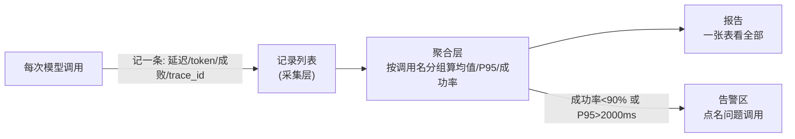

# 第 04 课　模型性能监控 Dashboard

前三课的项目都"能跑"了。但上线的系统光能跑不够——用户问"现在怎么变慢了""为什么老失败"，你得拿得出数据。这一课做一个命令行监控工具：采集每次模型调用的延迟、token 消耗、成功与否，聚合成一张一眼能看的报告，指标异常自动告警。

---

## 一、为什么第一个 Dashboard 是命令行

旧版教程在这里直接写了一个 Streamlit 网页面板——那其实是第 14 章的技能。我们反过来：先把"采集 → 聚合 → 告警"这条数据链路用命令行做扎实，界面是之后穿的衣服。这和第 11 章是同一个道理在那里打了个底：**没有监控的系统是盲飞**——你不知道它慢不慢、贵不贵、稳不稳，出了事只能靠用户来当报警器。

三个指标先说清楚为什么要盯它们：

- **延迟**：用户等的每一秒都是体验。平均值会骗人（少数快请求拉平了慢请求），所以要看 **P95**——95% 的请求都快于这个值，剩下 5% 是最倒霉的用户。
- **成功率**：失败率哪怕只有 5%，量大起来就是每小时几百个投诉。
- **token**：这是钱。每次调用花了多少 token，乘以单价就是账单；突然暴涨往往意味着提示词失控或死循环。

就像汽车仪表盘：速度（延迟）、油量（token）、故障灯（成功率）——平时扫一眼，亮红灯才停车检查。

---

## 二、数据流：采集、聚合、告警



采集层一条记录就是一个字典——真实系统里这一步对应往日志/数据库里写一行；聚合层是纯计算，把散记录压成几个数；告警是聚合结果上的一层判断。三层各司其职，将来不管数据来自模拟还是真实线上，后两层原样能用。

---

## 三、配套代码怎么读

打开 `monitor_dashboard.py`（约 150 行，纯标准库）：

1. **record_call()**：采集。接收调用名、延迟、token、成败，附上时间戳和 trace_id 存入列表。trace_id 就是第 11 章 11.4 可观测性里那串"一次调用的身份证"——报告里每行都能顺着它翻回原始日志。
2. **aggregate()**：聚合。按调用名分组，每组算出调用次数、成功率、平均延迟、P95 延迟、平均 token。P95 的算法在代码里就三行：排序后取第 95 百分位位置的值。
3. **check_alerts()**：告警。成功率低于 90% 或 P95 超过 2000ms 的调用，点名进告警区——阈值写成一个常量字典，改起来一目了然。
4. **render_report()**：报告。所有调用排成一张对齐的表，末尾是告警区；没有异常就打一句"一切正常"。
5. **demo() / main()**：`demo` 用模拟数据跑全流程（故意混入一个"高失败率"和一个"慢调用"，让你亲眼看到告警被触发）；`python monitor_dashboard.py ask "翻译这段话"` 演示单次记录的样子。

## 四、跑起来

```
python monitor_dashboard.py
```

输出是一张表：每个调用一行，成功率、P95、token 排开；表下面是告警区——你会看到"ocr_api"被点名（成功率 40%），"summarize"被点名（P95 超标）。找找看为什么它们中招，再打开代码改一改模拟数据，让告警清零——改数据的过程就是理解阈值的过程。

---

## 五、和真实监控的差距

生产环境还差三块，但方向不变：

- **采集**：从"模拟记录"换成真实埋点——在每个调用函数里包一层 `record_call()`（第 11 章 11.4 演示过怎么包），或接 OpenTelemetry 这类标准方案
- **存储**：列表换时间序列数据库，支持"昨天的 P95 和今天比"
- **展示**：表格换曲线图，能看出趋势——这正是学完第 14 章回来要补的界面

核心提醒：监控的价值不在"有个面板"，而在**阈值背后的动作**——告警响了谁去处理、怎么定位（trace_id 顺着查）、处理完怎么复盘。工具只占三成，剩下的七成是这套流程。

---

## 学完第 14 章回来加的扩展环节

学完第 14 章回来：用 Streamlit 把 `render_report()` 的表格换成网页面板，加成功率/延迟的折线趋势图，告警行标红。`aggregate()` 和 `check_alerts()` 原样复用——你会发现这一课已经把"难而正确"的数据链路做完了，界面只剩半天功夫。

---

## 想一想

1. 为什么监控延迟要看 P95 而不是平均值？构造一组数据（10 个数），让平均值很好看但 P95 很难看。
2. `check_alerts()` 的阈值是写死的常量。哪些调用的阈值应该更严、哪些可以放宽？说说你的判断依据（提示：用户直接面对的调用 vs 内部批处理）。
3. 报告里"summarize"成功率 100% 但 P95 超标、token 均值也高。顺着 trace_id 排查，你觉得最可能的三个原因是什么？
4. （动手）给 `aggregate()` 加一列"错误次数"，并在 `record_call()` 里支持记录失败原因字符串——体会"采集字段多一个，下游全链路都要跟上"。

---

## 小结

- 监控三板斧：延迟（看 P95 别看均值）、成功率（失败即体验事故）、token（直接换算成钱）。
- 数据链路三层：采集（一条记录一个字典+trace_id）→ 聚合（分组算指标）→ 告警（阈值点名）。本课用纯标准库把三层全部真跑通了。
- 阈值不是技术参数而是业务决定：告警必须连着"谁来处理、怎么查"的流程才有价值。
- 网页面板是学完第 14 章后的穿衣环节，数据链路才是主体。

下一课解决另一个上线的烦恼：工具越接越多、接口五花八门怎么管？我们把它们统一到一个标准协议后面——认识 MCP 智能工具集成平台。

---

2026 年 10 月
