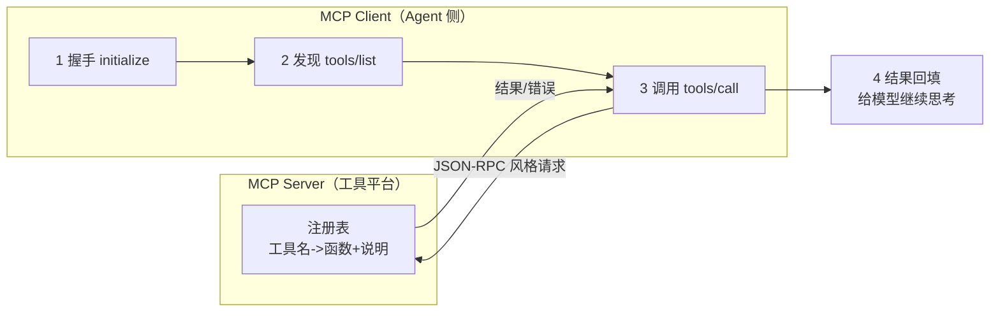

# 第 05 课　MCP 智能工具集成平台

上一课结束时我们留了个烦恼：Agent 的工具越接越多，每个工具一套接口、一套参数，接十种工具就要写十遍胶水代码。这一课的解法是行业标准做法——把它们统一到一个协议后面，这就是 MCP（Model Context Protocol，模型上下文协议）。

---

## 一、先讲清楚 MCP 解决什么问题

没有标准协议的世界是这样的：你要给 Agent 接数据库、接 GitHub、接 Slack，每个服务的调用方式都不一样——参数格式不同、鉴权方式不同、返回结构不同。你的代码里全是"特制适配"，接一个写一份，改一个动全身。

MCP 做的事类似 USB 接口。USB 出现之前，键盘一个口、鼠标一个口、打印机又一个口，各有各的插法；USB 定下"统一的插座和对话方式"后，任何设备只要按标准说话就能即插即用。MCP 就是 AI 世界的 USB：工具方把能力包装成 MCP Server（提供工具列表和调用入口），模型方做 MCP Client（发现工具、发起调用）。两边只要遵守协议，互相不需要知道对方内部怎么实现。

于是"接十种工具"变成"接一个协议"。第 6 章我们跑过最小的 MCP server 消息形状，这一课把它放大成一个能管多个工具的小平台。

---

## 二、平台的四个阶段

一次完整的 MCP 交互分四步，我们的平台按这四步组织代码：



- **握手**：双方互通姓名和版本，确认"说的同一种话"
- **发现**：Client 问"你有哪些工具？"，Server 返回工具清单（名称+说明+参数）——Agent 就靠这份清单决定用哪个工具
- **调用**：Client 发标准格式的请求（工具名+参数），Server 路由到对应函数执行
- **回填**：结果按标准格式返回，Agent 把它当作"观察"继续下一轮思考

眼熟吗？发现+调用+回填，正是第 02 课 Agent 循环里的"行动-观察"。MCP 没有改变 Agent，它只是把"行动"这一步标准化了。

---

## 三、配套代码怎么读

打开 `mcp_platform.py`（约 170 行，纯标准库）：

1. **三个模拟工具**：数据库查询、GitHub 仓库信息、Slack 发消息——每个就是一个普通函数，注册时统一登记"名称+说明+参数表"。
2. **MCPServer 类**：平台本体。`register()` 收编工具；`handle()` 是协议入口，接收"JSON-RPC 风格"的请求字典（方法名+参数），按方法名路由到握手/发现/调用三个处理器；每次调用都记录进调用历史。
3. **MCPClient 类**：Agent 侧。它不直接碰工具函数，所有交互都走 `handle()` 发标准请求——这就是协议的意义：**哪怕 Server 换成别人写的、跑在别的机器上，Client 代码一行不改**。
4. **demo() / main()**：演示完整四阶段——握手、打印发现的工具清单、连续调用三个工具、故意调一个不存在的工具看错误处理。

## 四、跑起来

```
python mcp_platform.py
```

输出里你重点看三样东西：握手成功后的"协议版本"；`tools/list` 返回的工具清单（注意每个工具的说明和参数描述——Agent 选工具全靠它）；一次故意失败的调用返回的标准错误结构（`isError: true` + 中文错误信息），而不是崩溃。**错误也是协议的一部分**——标准格式的错误让调用方可以程序化处理，这在生产里极其重要。

---

## 五、和真实 MCP 的对应关系

真实 MCP 是 Client 和 Server 两个独立进程（甚至两台机器）之间走标准传输层通信，消息用 JSON-RPC 2.0 格式。我们的精简版把它们放在同一个进程里、用函数调用模拟消息传递，但**消息的形状和流程与协议一致**：initialize/tools/list/tools/call 这套方法名、请求与响应的字段，你在真 MCP 里会原样见到。学完本课再去装官方 SDK 跑真 Server（第 6 章第 05 课已经演示过），你会发现只是"换个传输层，协议没变"。

---

## 学完第 14 章回来加的扩展环节

学完第 14 章回来：用 FastAPI 把 `MCPServer.handle()` 包成 HTTP 接口，Client 通过网络请求调用——这一个改动就把它从"同进程模拟"升级成"跨进程真协议"，正好练手接口层。工具平台的管理页面（注册/禁用工具、看调用历史）也一并补上。

---

## 想一想

1. 如果不给工具写说明和参数描述，只留函数名，`tools/list` 返回的清单对 Agent 意味着什么？这解释了"好工具文档"的价值吗？
2. Client 代码为什么能"Server 换了实现也不用改"？在我们的代码里，这个保证靠哪一层实现？（提示：Client 是否 import 过任何工具函数）
3. 调用不存在工具时，平台返回标准错误而不是抛异常。如果改成直接抛异常，Client 和 Server 各会出什么问题？
4. （动手）往平台里注册一个你自己的工具（比如查天气的假函数），跑 `tools/list` 看新工具怎么出现在清单里——体会"即插即用"。

---

## 小结

- MCP 是 AI 工具接入的标准协议，像 USB 一样统一插座：工具方做 Server，模型方做 Client，互相只认协议不认实现。
- 一次完整交互四步：握手 → 发现（tools/list）→ 调用（tools/call）→ 结果回填；发现清单是 Agent 选工具的唯一依据。
- 错误也是协议的一部分：标准格式的错误让调用方能程序化兜底，而不是崩溃。
- 精简版同进程模拟，消息形状与真实 MCP 一致；跨进程只差一层传输，接口实现是第 14 章的挂点。

最后一课，我们把前面所有零件拼到极致：不是一个 Agent，而是一支分工明确的 Agent 团队——Multi-Agent，并落到一个完整的企业助手形态。

---

2026 年 10 月
