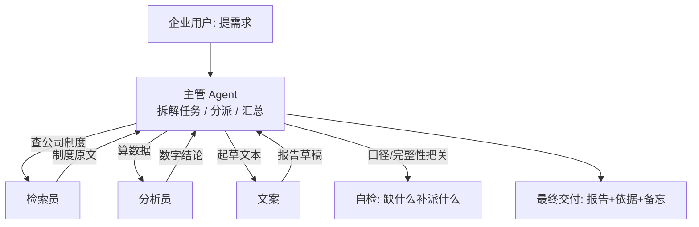

# 第 06 课　Multi-Agent 协作与企业助手

最后一课，我们把这一章的零件拼到极致。前五课做的都是"单个 Agent"：一个知识库、一个执行者、一个客服、一个工具平台。真实企业里的问题往往更大——一份市场分析要查资料、算数据、写报告、审口径，一个人（Agent）干不过来，得**组队**。

---

## 一、为什么需要一支"Agent 团队"

让一个 Agent 包打天下，有两个老毛病：

- **上下文爆炸**：所有中间结果都堆在它脑子（上下文）里，任务一长就开始忘事、串戏
- **杂而不精**：提示词里既要它懂检索、又要懂算账、还要会写作，哪个都差口气

Multi-Agent 的思路很朴素：与其培养一个全才，不如**组一支专科医生团队**——每位 Agent 只精通一摊事，有一位主管负责分活儿和把关。就像一家小公司：老板不用什么都自己干，他把活儿分给财务、文案、调研员，收上来拼成最终交付。每个角色上下文干净、提示词聚焦，质量自然上去。

分工还有个隐藏好处：**出问题好定位**。报告数据错了，十有八九是分析员；口吻不对，那是文案的事——比在一个万能 Agent 的漫长上下文里大海捞针容易多了。

---

## 二、主管-工人怎么协作



看这条主循环：主管把需求拆成子任务，派给对应工人；工人各自干完交回结果；主管汇总并**自检**——发现缺料（比如分析员缺个前提数据）就再派一轮。这就是 Multi-Agent 系统的骨架：**分派 → 干活 → 收结果 → 补派 → 汇总**。

工人之间不直接对话，一切经主管中转——这是最简单也最稳的协作拓扑。工人互相私聊的"多边协作"看着高级，但消息一乱就是车祸现场，生产系统大多从"星型拓扑"起步。

---

## 三、配套代码怎么读

打开 `multi_agent_app.py`（约 170 行，纯标准库）：

1. **工人角色**：`worker_research`（查内置制度库）、`worker_analyst`（算数）、`worker_writer`（按模板起草文本）。每个工人就是一个函数：输入子任务描述，输出一段结果——真实系统里工人各自是一个带专属提示词的 LLM 调用。
2. **AGENTS 注册表**：`角色名 -> (函数, 一句话职责)`。主管选工人靠这份花名册，逻辑与第 02 课选工具完全同构——**对主管来说，工人就是它的工具**。
3. **supervisor()**：主管主循环。第一步拆任务（规则版按分句+关键词；真实版让 LLM 输出 JSON 计划）；第二步按子任务选工人执行；第三步自检补派（发现"需要的数据缺失"就追加子任务）；最后汇总成企业报告。
4. **assemble()**：汇总收尾——把各工人产出去重后拼成一份带依据的完整交付物。
5. **demo() / main()**：默认演示"季度营收简报"；也可 `python multi_agent_app.py "写一份新员工入职指引"` 换个需求再跑。

## 四、跑起来

```
python multi_agent_app.py
```

输出是一份"企业助手工作台账"：主管先列出拆解出的子任务清单，然后每个子任务一行"派给谁 → 干了什么 → 交回什么"，最后是拼装好的完整报告。换第二个场景再跑，同一支团队干出完全不同的活儿——**团队没变，变的是主管的拆解**，这正是 Multi-Agent 的弹性所在。

代码里值得留意自检补派那一段：主管发现分析员引用的前提没着落时，会自动追加一个"检索员先查数据"的子任务。真实 Multi-Agent 系统里，这类"发现缺料→回头补"的闭环正是可靠性的关键，也是单 Agent 长上下文最容易乱掉的地方。

---

## 五、这就是"企业助手"的底座

合并旧教程的两课（Multi-Agent 系统 + 企业 AI 助手），你会发现"企业助手"不是第六种新系统，而是**前五课所有零件的组装形态**：

- 知识库检索（第 01 课）→ 检索员的手艺
- 工具调用与注册表（第 02、05 课）→ 主管的花名册
- 口吻与话术（第 03 课）→ 文案模板
- 监控埋点（第 04 课）→ 给每次派工记台账（生产必上）

本章到此收束：从"能答出处的知识库"到"会组队的智能体团队"，六个项目就是一条完整的 AI 应用生产线。接下来该做的：把每个项目的 README 补成自己的话，挑一两个项目改出你自己的版本——作品集里放"我改过的"，不放"我抄过的"。

---

## 学完第 14 章回来加的扩展环节

学完第 14 章回来：给这支团队穿两层衣服——FastAPI 接口让外部系统提交任务，Streamlit 页面实时展示主管派工的甘特图和工人状态。旧教程的企业助手界面（登录、会话管理、报表导出）到时候都是顺手的扩展。

---

## 想一想

1. 对照第 02 课：主管选工人和 Agent 选工具，代码结构几乎一样。那 Multi-Agent 相比"一个 Agent + 一堆工具"到底多了什么能力？什么情况下其实不需要 Multi-Agent？
2. 工人之间为什么不直接对话、一切经主管中转？构造一个"如果检索员和分析员直接私聊可能出什么乱子"的具体场景。
3. `supervisor()` 的自检补派只查了"数据缺失"一种情况。再想两种该触发补派的情况（比如文案产出为空），动手在代码里加一条检查。
4. （动手）给团队加一个新工人 `worker_reviewer`（审核员）：主管在汇总前把报告草稿派给它"挑毛病"，有毛病就打回文案重写——体验一次最小闭环的"质量工序"。

---

## 小结

- Multi-Agent 用"专科分工 + 主管协调"替代"一个全才"：上下文干净、提示词聚焦、问题好定位。
- 最稳的协作拓扑是星型：工人不私聊，一切经主管中转；主循环是分派 → 干活 → 收结果 → 补派 → 汇总。
- 对主管而言，工人就是它的工具——选工人的注册表与选工具同构，这是本章知识的大合流。
- 企业助手不是新系统，而是本章六个项目能力的组装形态。

第六课结束，本章收官。你的作品集里现在应该有六个亲手跑通的项目——下一站，第 13 章，我们站在架构师的视角回看这些系统该怎么设计和长大。

---

2026 年 10 月
