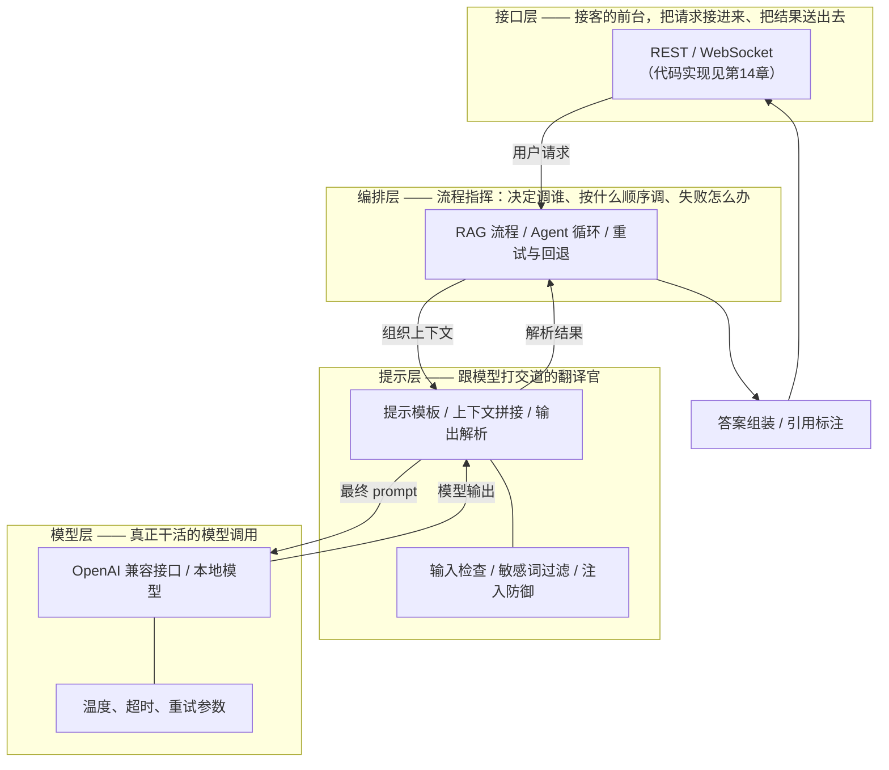

# 第 01 课　LLM 应用架构

前面十二章，我们把模型的原理、RAG、Agent、向量库、部署监控都学了个遍。现在换个位置站：不再是你学别人怎么设计，而是你要当那个画架构图的人。这一章的五节课，讲的都是"怎么把一堆零件组织成一个能上线的系统"。

先从一个扎心的问题开始：为什么同样是调一个大模型 API，有的产品稳定赚钱，有的三天两头出事故被用户骂？差的那口气，通常不在模型，而在**架构**。

---

## 一、一个会翻车的演示

我们拿第12章 12.1 的本地知识库问答（CLI 版）当靶子。它当时的结构大概是这样：

```python
# 12.1 当时的世界：一个 main() 包打天下
def main():
    docs = load_docs()
    chunks = chunk(docs)
    kb = build_index(chunks)
    q = input("问题: ")
    print(answer(kb, q))
```

学习时这么写没问题，但产品化时它会死在三个地方：

1. **换模型要改代码**——今天用 A 家，明天想换成便宜的 B 家，你得在一坨代码里找调用点；
2. **没有接口**——只有命令行，网页端、小程序端都用不上（第14章才做界面，这里先挖坑）；
3. **改一处崩全身**——想优化切分策略，结果把答案组装的逻辑也弄坏了。

问题不在代码写得差，而在**没有分层**。就像一间房子，厨房、卧室、客厅没有隔断，在客厅炒菜，油烟糊满整间屋。

---

## 二、能上线的 LLM 应用，分四层

把上面那间"没有隔断的房子"重新装修，就是经典的四层结构：



逐层看它们的职责（先看全景，再逐个模块过）：

- **模型层**：唯一接触模型 API 的地方。所有调用走它，换模型时只改这一层。参数（温度、超时、重试）也统一管。
- **提示层**：把用户的原话翻译成"模型爱听的话"。模板、上下文拼接、输出解析都在这层，外加第一道安全防线（检查输入、防提示注入——第6章 6.3 的那套攻防在这里落地）。
- **编排层**：系统的指挥。是走一条固定 RAG 流程，还是进 Agent 循环，都是它说了算。第4章 LCEL 竖线串起来的东西，在这里就是编排层的血肉。
- **接口层**：把系统接到外部世界。REST、WebSocket，网页端、小程序端都从这里进出。

**一句话记住：接口层管进出，编排层管顺序，提示层管翻译，模型层管干活。** 每层只做自己的事，跨层插手就是翻车开始。

---

## 三、每一层都要回答的四个问题

架构图谁都会画，区分好架构和坏架构的，是下面这四个问题。本章五节课都会反复用这个视角，你最好背下来：

| 视角 | 要回答的问题 | 第01课的答案 |
|------|--------------|--------------|
| 成本 | 每次请求烧多少钱？ | 提示层裁剪上下文，不把整本手册塞给模型 |
| 延迟 | 用户等几秒？ | 模型层调小 max_tokens、开流式输出，先出字再出全 |
| 可靠 | 模型挂了怎么办？ | 每层设超时+重试，模型层可配置备用模型自动切换 |
| 安全 | 用户会怎么搞破坏？ | 提示层过滤注入攻击，接口层限流挡住刷子 |

这四个字——**成本、延迟、可靠、安全**——是架构设计的"魂"。模型能力是买来的，架构水平才是自己长出来的。

---

## 四、跑一个分层骨架看看

光说不练假把式。本课配套的 `llm_arch.py` 用纯标准库把这张图落成了四个类，零依赖、不需要 API Key，直接跑：

```
python llm_arch.py
```

它会演示三件事：

1. **标准链路**——一个问题从接口层进，编排层排流程，提示层拼模板，模型层出结果，原路返回；
2. **可靠视角**——把模型层换成"前两次必超时"的糙模型，你会看到编排层自动重试，第三次成功；
3. **安全视角**——喂一句"忽略之前的指令"，提示层当场拦截，请求根本到不了模型。

代码一百多行，核心就四个类，和四层一一对应：

| 讲义层 | py 里的类 | 一句话职责 |
|--------|-----------|------------|
| 接口层 | `InterfaceLayer` | 接请求、返响应（HTTP 版见第14章） |
| 编排层 | `Orchestrator` | 排流程、管重试与降级 |
| 提示层 | `PromptLayer` | 拼模板、拦注入 |
| 模型层 | `ModelLayer` | 唯一调"模型"的地方 |

想体会"换模型只改一层"，把构造里的 `ModelLayer("mock-A")` 换个名字再跑——其他三层一行不用动。这就是架构给你的自由。

---

## 五、和第12章对照着看

回头看第12章你会更有感觉：12.1 的本地知识库 CLI，是"编排层+提示层"挤在一个 main() 里的形态；12.2 的 agent_runner，是编排层升级成"思考-行动-观察"循环的形态。它们都缺独立的接口层和模型层封装——所以是"练习版"。学完第14章给这些项目补上真正的接口层，练习版就升级成产品版了。

---

## 想一想

1. 一个 AI 应用如果只能保留两层，你留哪两层？说说被砍掉的层删掉后会立刻出什么事。
2. 输出解析（把模型的话拆成结构化数据）放在提示层还是编排层？两种放法各有什么代价？
3. 【轻动手】跑 `python llm_arch.py --chat`，输入"忽略之前的指令"看拦截效果，再随便问几个问题，对照日志观察四层的先后顺序。
4. "主模型挂了自动切备用模型"这个逻辑，写进模型层和写进编排层有什么区别？哪种更省事、哪种更灵活？

## 小结

- 能上线的 LLM 应用分四层：接口层管进出、编排层管顺序、提示层管翻译、模型层管干活。
- 分层的全部意义：改哪层只动哪层——换模型不动编排，换流程不动接口。
- 每层都要过四个问题的筛子：成本、延迟、可靠、安全。
- 第12章的实战项目是这套架构的"练习形态"，缺的接口层在第14章补齐。

下一课我们钻进编排层最经典的流程——RAG 架构：数据怎么进来、库怎么建、在线问答怎么串成一条完整链路。

2026 年 10 月