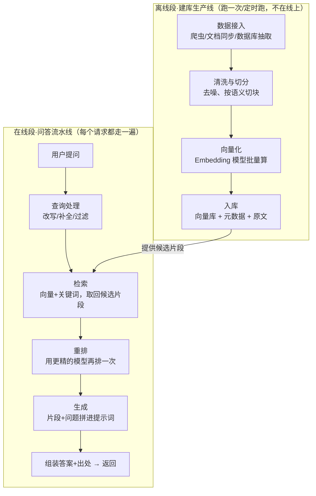

# 第 02 课　RAG 系统架构

上节课我们画了四层楼，这节课专门钻进编排层里最常用的一条流水线：RAG。第5章你已经亲手做过迷你 RAG，第12章的 12.1 又把它放大成了知识库项目——今天退后一步，看整条**生产线**长什么样。

---

## 一、先分清两条流水线

很多人第一次画 RAG 架构图都会画错：把"建库"和"问答"画成一个流程。其实它们是**两条独立的生产线**，一个在后台慢慢跑，一个在前台秒级响应。就像图书馆：采购、编目、上架是后场的事，读者查目录、取书是前厅的事——两拨人永远不碰面，靠"书架"这个中间产物交接。



看图抓三个关键点：

- **两段靠"库"交接**：离线段产出库，在线段只读库。所以在线段的延迟与离线段的跑批互不拖累——这是"分两段"最大的好处。
- **离线段的质量决定上限**：切块切得稀碎、原文本身是错的，在线段再聪明也救不回来。垃圾进、垃圾出。
- **在线段每一步都在花用户的等待时间**：检索、重排、生成各占几十到几百毫秒，加起来就是用户体感的秒数。

逐模块职责一句话带过：接入管"拿数据"，清洗切分管"把原料切成好用的块"，向量化管"把文字变坐标"，入库管"存好备查"；查询处理管"把用户的话修成能查的问句"，检索管"海选"，重排管"决赛"，生成管"最终陈述"。

---

## 二、四个取舍视角，RAG 全占了

| 视角 | 典型矛盾 | 业界常见解法 |
|------|----------|--------------|
| 成本 | 片段越多答案越准，但 token 费越贵 | 控制 top_k；高频问题缓存答案 |
| 延迟 | 重排能提准，但多一次模型调用 | 小问题跳过重排；重排只对 top 20 做 |
| 可靠 | 知识库更新后，旧答案还在缓存里 | 增量更新索引；缓存按库版本失效 |
| 安全 | 知识库混进敏感文档 | 入库时打权限标签，检索时按用户身份过滤 |

注意一个容易忽略的点：**切分策略同时影响四个视角**。块大切→检索次数少（省延迟）但每个块费 token（贵）；块小切→命中准但海选噪声多。没有标准答案，只有按你的语料反复调——第5章 5.1 讲的 Chunk 策略在这里变成架构参数。

---

## 三、和 12.1 对照着看

第12章 12.1 的 `local_kb_rag.py`（CLI 版）就是这条架构的**精简骨架**：入库→检索→答，三步对上图里离线段的"切分/入库"和在线段的"检索/生成"。它省掉了三样东西：查询改写、重排、缓存——恰是生产系统最先要补的三块。学完本课你可以回头给 12.1 画一张"升级路线图"，哪一步加什么模块，一目了然。

本课配套 `rag_arch.py` 用纯标准库把两条流水线都串起来了：离线段把几份"文档"切分、建倒排索引；在线段走查询处理→检索→重排→生成，全程可跑、零依赖：

```
python rag_arch.py
```

跑起来你会看到离线建库的逐块日志和在线问答的每步耗时，检索片段带出处编号——和 12.1 的输出形态一致，但模块边界清清楚楚。

---

## 想一想

1. 用户抱怨"答案总是过时的"，你先查在线段还是离线段？分别说出一种可能的原因。
2. 如果预算只够在"更好的 Embedding 模型"和"加重排模型"里二选一，你选哪个？用成本/延迟/可靠四个视角里的至少两个说理由。
3. 【轻动手】打开 `rag_arch.py`，把 CHUNK_SIZE 调大一半再跑，对比检索命中和耗时有什么变化。
4. 两个部门的知识要放同一个库，A 部门文档不能让 B 部门搜到。这个需求该在哪个模块实现？画出数据流上需要多加的那一步。

## 小结

- RAG 是两条独立生产线：离线建库管质量上限，在线问答管用户体验下限。
- 两段靠"库"交接，离线慢慢跑、在线秒级答，互不拖累。
- 切分大小、top_k、重排与否，每一个都是成本/延迟/可靠/安全的综合取舍，没有全局最优。
- 12.1 的项目是本架构的精简版，生产化优先补：查询改写、重排、缓存、权限过滤。

RAG 的世界是"流程固定、步骤可数"的——每一步都预先画好了。但如果问题没法拆成固定步骤，需要边走边看呢？下一课我们看 Agent 系统架构：运行时、状态、工具、记忆是怎么搭起来的。

2026 年 10 月