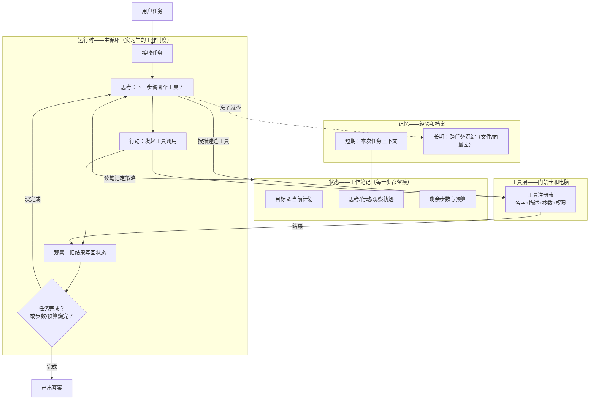

# 第 03 课　Agent 系统架构

上节课的 RAG 是流水线：步骤固定，水从头流到尾。可有些任务没法预先画好流程——"帮我把这个季度的销售数据查出来，和去年对比，写份总结"。查几次、先查什么，得看中间结果才能定。这类"边走边看"的任务，就轮到 Agent 出场了。

第6章你亲手写过"思考-行动-观察"循环，第12章 12.2 又把它做成了任务执行系统。今天我们站到架构师的视角：一个能扛生产的 Agent 系统，**运行时、状态、工具、记忆**这四大件怎么搭。

---

## 一、全景图：四大件怎么咬合

先给一个生活类比：Agent 系统就像一个**新来的实习生**。运行时是他的作息制度（什么时候该干什么的规矩），状态是他手头的工作笔记，工具是公司发给他的门禁卡和电脑，记忆是他脑子里的经验和抽屉里的档案。



四大件的职责，一句话一个：

- **运行时**：循环的发动机。只负责"调度"——推着思考、行动、观察转起来，自己不干活。它还握着**刹车**：步数上限、预算上限、敏感操作要人工确认。
- **状态**：每一步的笔记。为什么"思考"要靠它？因为模型每次调用都是失忆的，上一轮查到了什么，全靠状态拼进下一轮的提示词。状态设计得好坏，直接决定 Agent 的智商。
- **工具层**：注册表是核心——每个工具带名字、描述、参数说明、权限等级。模型选工具全靠描述，描述写得烂，工具再强也白搭（第6章 6.7 讲的工程细节在这里就是架构的一部分）。
- **记忆**：短期记忆就是状态里的轨迹；长期记忆是跨任务的，落文件或向量库（第5章的检索技术在这里复用）。

---

## 二、四个视角怎么落在 Agent 上

| 视角 | 风险点 | 常见解法 |
|------|--------|----------|
| 成本 | 循环失控，一任务几十次模型调用 | 状态里记步数/预算，超限强制收尾 |
| 延迟 | 串行循环一步接一步，慢 | 无依赖的工具调用并行发；简单任务降级为固定流程 |
| 可靠 | 工具报错，循环卡死或胡来 | 工具层统一 try/except，错误作为"观察"喂回去让模型自己调整 |
| 安全 | 模型选中了危险工具（删库、转账） | 工具分级：只读随便调，写操作要确认，高危直接禁用 |

和 RAG 对比着看会更清楚：RAG 的控制流是**人写死的**（先检索后生成），Agent 的控制流是**模型现场定的**。自由度换来了能力，也买来了上面四行风险——这就是为什么生产级 Agent 必须带刹车。

---

## 三、和 12.2 对照着看

第12章 12.2 的 `agent_runner.py` 就是本图的精简版：运行时循环和状态有了，但工具是写死的两三个、没有长期记忆、没有预算刹车。生产化补课的优先级恰好是本课的架构清单：先加预算刹车（防失控），再上工具注册表（好扩展），最后挂长期记忆（有积累）。

配套 `agent_arch.py` 用纯标准库把四大件都搭出来了：运行时循环、状态字典、三个模拟工具、json 落盘的长期记忆，还有步数刹车：

```
python agent_arch.py
```

跑起来你能看到每次"思考-行动-观察"的轨迹打印，任务完成后状态整包存进临时文件——下节课我们来说：这些工具如果不止本系统内的三个，而是全公司上百个、还要给别的系统共用，该怎么管。

---

## 想一想

1. "最大步数 20"这个刹车写在哪一层最合适？运行时还是状态里？为什么另一个不合适？
2. 工具调用报错了，把报错信息当"观察"喂回给模型，和直接终止任务，各适合什么场景？
3. 【轻动手】打开 `agent_arch.py`，把 MAX_STEPS 改成 2 再跑，观察刹车触发时 Agent 是"体面收尾"还是"半途而废"，想想收尾话术为什么重要。
4. 如果两个 Agent 协作（一个查数据、一个写报告），状态该各自持有还是共享一份？说出你方案的隐患。

## 小结

- Agent 系统四大件：运行时管调度与刹车，状态管每步留痕，工具层管能力清单，记忆管经验沉淀。
- 模型每次调用都失忆，状态的职责就是把上下文喂回去——状态设计就是 Agent 的智商设计。
- Agent 用"模型现场决定控制流"换能力，代价是成本/延迟/可靠/安全四项全要额外设防。
- 12.2 是精简版，生产化三步：预算刹车 → 工具注册表 → 长期记忆。

工具多了、系统多了，各注册各的就会乱成一锅粥。下一课讲 MCP 工具架构：一个标准协议，让全公司的工具统一注册、统一发现、统一调用。

2026 年 10 月