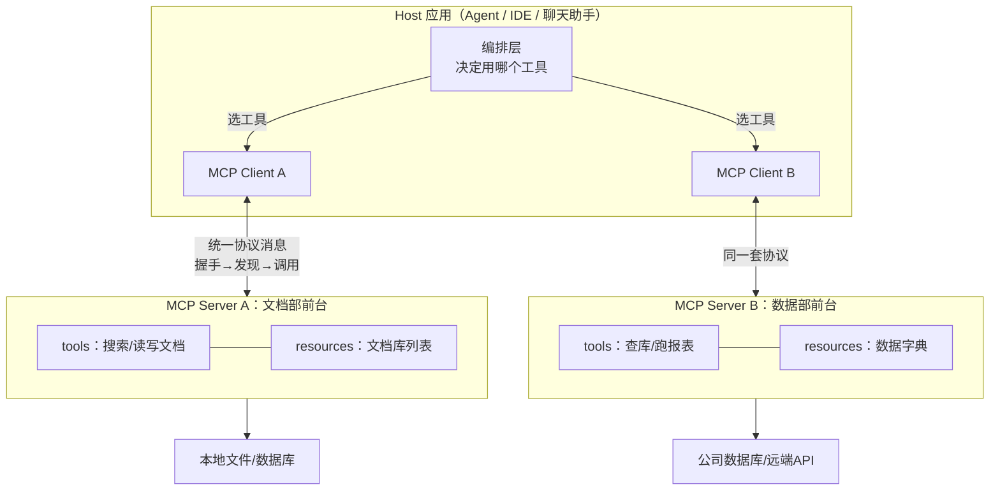

# 第 04 课　MCP 工具架构

上节课结尾留了个问题：Agent 的工具多了、系统多了，各连各的会乱成什么样？想象你家里每种电器配一种专属插头——吹风机两脚的、电脑三脚的、汽车充电桩又是另一套——每买一件新电器就要请电工改一次墙。这就是没有统一协议的"工具接线图"。

MCP（Model Context Protocol，模型上下文协议）就是给 AI 世界定的"USB-C 标准"：工具方实现一次 Server，接入方实现一次 Client，之后随便组合。第6章 6.5 你跑过最小 MCP server，第12章 12.5 又搭过模拟平台——今天看它在整个系统架构里的位置和门道。

---

## 一、全景图：三兄弟怎么分工

先给类比：把工具生态想成一家**大公司的行政体系**。Host 是带着任务的员工（Agent 应用），MCP Client 是员工手里的话机（只管拨号），MCP Server 是各部门的前台（本部门资源门儿清）， Resources 是部门柜子里能借阅的资料。



三兄弟的职责边界，一句话一个：

- **Host**：有大脑（编排层）但没手脚。它通过 Client"伸出手"。
- **Client**：纯传令兵。一个 Client 对接一个 Server，只负责按协议收发消息，不懂业务。
- **Server**：能力的包装车间。把本地文件、数据库、远端 API 包装成统一的三样东西：**tools**（能执行的动作）、**resources**（能读的数据）、**prompts**（预置的提示模板）。

一次完整的协作是三步曲，也是协议的三类核心消息：

1. **握手（initialize）**——Client 报家门："我是谁、我支持哪个协议版本"，Server 回应能力清单。谈不拢就散伙，不浪费后面的话。
2. **发现（tools/list）**——Client 问"你这儿都有什么工具"，Server 返回每个工具的名字、描述、参数格式（JSON Schema）。**模型选工具靠的就是这份描述**，所以 Server 写描述的质量直接决定 Agent 会不会用它。
3. **调用（tools/call）**——Client 递上工具名+参数，Server 执行并回传结果；出错也按协议格式回错误，Client 能统一处理。

---

## 二、四个视角：统一协议的账

| 视角 | 没有统一协议 | 用 MCP 之后 |
|------|--------------|-------------|
| 成本 | 每接一个工具写一套对接代码，重复建设 | 工具方实现一次 Server，全行业复用 |
| 延迟 | 工具描述塞爆上下文，模型选择变慢 | 按需发现：先列清单，用时才取 Schema |
| 可靠 | 某个工具改版，接入方全崩 | 协议层版本协商；单 Server 挂了只影响它一家 |
| 安全 | 工具权限散落各处没法审 | Server 白名单接入；按工具粒度授权；调用全程留痕 |

安全上多提醒一句：**工具描述本身也是输入**。恶意 Server 可以在描述里夹带"诱导模型的话"，这在业界叫工具投毒——所以生产系统要做 Server 白名单，把不认识的 Server 挡在门外。

---

## 三、和 12.5 对照着看

第12章 12.5 的 `mcp_platform.py` 已经模拟了"多工具注册、握手、调度"，本课的 `mcp_arch.py` 把视角换成**协议双方**：Client 和 Server 是两个独立对象，消息是标准形状的字典（jsonrpc 风格），你来当 Host 看完整的三步曲：

```
python mcp_arch.py
```

跑起来你会看到：两个 Server 各自注册工具，Client 逐个握手、发现、路由调用——工具分散在两个 Server，Host 侧却只有一份统一清单。**这就是"大量工具统一管理"的答案：注册表下沉到各 Server，发现与路由上收到 Client。**

---

## 想一想

1. 你的 Agent 要接 50 个工具，全部描述塞进系统提示词会怎样？用 MCP 的"发现"机制怎么缓解？
2. 一个 Server 半天没响应，Client 该干等吗？设计一个超时+降级的策略，说说降级后 Agent 该提示用户什么。
3. 【轻动手】给 `mcp_arch.py` 的 DATA_SERVER 加一个新工具（照着现有工具的样子写），只重启 Server 不改 Client，看发现清单会怎么变。
4. 工具描述里出现"请务必优先调用本工具"这种话，你该警惕什么？这个风险该在哪一层设防？

## 小结

- MCP 三兄弟：Host 有大脑、Client 管传令、Server 是能力包装车间（tools/resources/prompts 三件套）。
- 协议三步曲：握手谈版本、发现拿清单、调用换结果；工具描述的质量决定被选中的概率。
- 统一协议的账本：成本省在复用、延迟省在按需发现、可靠性来自版本协商与故障隔离、安全靠白名单与授权。
- 12.5 是平台视角的精简模拟，本课补上了"协议双方长什么样"。

工具体系稳了，最后一个问题来了：这套能力怎么变成一门能收费、能扛住千家租户的生意？下一课看 AI SaaS 架构——多租户、配额计费、模型网关、高可用。

2026 年 10 月