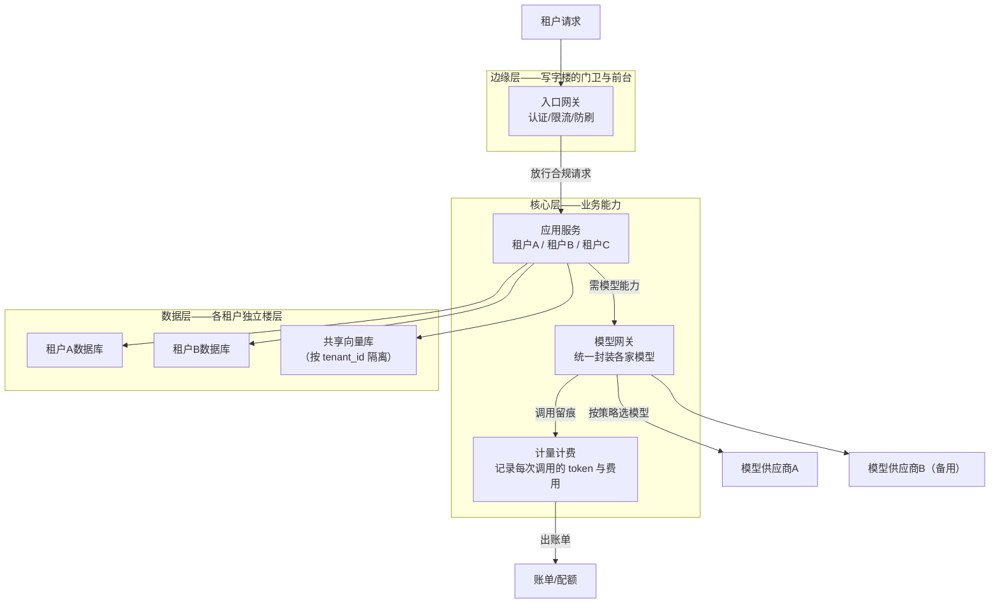

# 第 05 课　AI SaaS 架构

四节课下来，架构的四层、RAG 的双流水线、Agent 的四大件、MCP 的三兄弟都在你手里了。最后一课回答一个更现实的问题：这套东西怎么变成**一门生意**——成百上千家公司在同一个系统上用，谁多用谁多付钱，出了事互相不能牵连，深夜模型供应商崩了你的服务还得活着。这就是 AI SaaS（Software as a Service，软件即服务）架构。

---

## 一、全景图：从"能用"到"能卖"

先给类比：把整个系统想成一栋**商用写字楼**。租户（客户公司）各租各的楼层（数据隔离），前台统一发门禁卡（认证），物业按用电量收电费（计量计费），备用发电机保证停电照常营业（高可用）。



逐模块看职责与数据流：

- **入口网关**：所有请求的必经之门。认证（你是谁）、限流（你别刷）、路由（你该去哪个服务）。它挡下了 90% 的恶意流量。
- **模型网关**：全系统唯一调模型的地方。对上提供统一 API，对下管理多家供应商——主用 A 家，A 家超时自动切 B 家（这就是第01课模型层的"产品级放大版"）。
- **计量计费**：网关每次调用留痕（谁、用什么模型、多少 token），月底按量出账。没有它，你烧的是自己的钱。
- **数据隔离**：三种流派各有价位——独立数据库（最贵最隔离）、独立 Schema（中间）、共享表加 tenant_id 字段（最省，靠代码纪律保证不串）。多数团队从共享+字段隔离起步，出事才升级。

---

## 二、配额与计费：钱从哪里省出来

模型调用是 AI SaaS 最大的变动成本，所以**配额**（quota，允许用多少）是产品生命线，不只是收费手段：

| 视角 | 配额扮演的角色 |
|------|----------------|
| 成本 | 按租户设 token/次数上限，成本封顶可预算 |
| 延迟 | 付费大户走独立模型通道，防止互相挤兑 |
| 可靠 | 配额超限返回明确提示而不是烧穿所有额度 |
| 安全 | 异常配额消耗曲线 = 被盗刷的报警器 |

计费常见三档：**按量**（token 或次数，简单透明）、**套餐**（固定月费含额度，用户好预算）、**混合**（套餐+超额按量，业界主流）。选哪档看你的用户画像：用量稳定的 B 端爱套餐，波动大的 C 端爱按量。

---

## 三、高可用：深夜模型崩了你怎么办

SaaS 的承诺是"随时能用"，但模型供应商说崩就崩。生产系统用三层冗余接住：

1. **多供应商**：模型网关配主备两路，主路超时/报错自动切备路，用户无感。
2. **结果缓存**：相同问题直接回缓存答案——既省延迟又省成本，还少一次踩坑机会。
3. **优雅降级**：所有模型都挂时，返回"服务繁忙+稍后重试"，绝不裸抛 500。

配套 `saas_arch.py` 用纯标准库把这四块全演了一遍：三个租户、字段隔离的"数据库"、按租户限流的网关、token 计量出账、主备模型切换：

```
python saas_arch.py
```

跑完你会看到一份按租户汇总的账单，和一个租户超限后被拒的现场。

---

## 四、收束：这套架构，你已经搭过一遍了

回顾全章：第01课的四层是**骨架**，第02课的 RAG 和第03课的 Agent 是**核心业务能力**，第04课的 MCP 是**能力接入标准**，本课是**商业化的壳**。再看第12章——你的每个实战项目都能在这张图上找到自己的楼层。第13章到这里，你已经能从零画一张能上线的 AI 系统架构图了。

下一章我们终于动手写真正的界面：几行 FastAPI 把模型调用变成所有人能访问的 API——第01课挖的"接口层"的坑，在那儿填上。

---

## 想一想

1. 三种数据隔离流派（独立库/独立Schema/共享表加字段），一家 50 人初创公司该选哪个？说出两年内它的升级路径。
2. 一个租户凌晨三点调用量暴涨 100 倍，列出你的系统里最先报警的三个指标，以及各自的处置动作。
3. 【轻动手】打开 `saas_arch.py`，把租户 B 的配额改成和 A 一样大，观察账单变化，思考"配额即产品"这句话对不对。
4. "模型网关切到备用供应商后，提示词模板要跟着改吗？"——从这个问题出发，说说模型网关为什么要做"提示词适配层"。

## 小结

- AI SaaS 四件套：入口网关管门禁与限流、模型网关管多供应商与切换、计量计费管成本回收、数据隔离管租户互不串。
- 配额不只是收费，它是成本/延迟/可靠/安全四个视角的共同抓手。
- 高可用三板斧：多供应商主备、结果缓存、优雅降级。
- 全章收束：四层骨架 + RAG/Agent 能力 + MCP 标准 + SaaS 商业壳，第12章每个项目都是这张图上的一个楼层。

2026 年 10 月