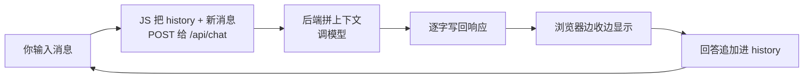

# 第 02 课　AI 聊天应用

上一课的情绪分析是"一问一答"，问完就忘。真正的 AI 聊天得记住前面聊过什么，还得让回答像打字一样一个个蹦出来。这一课就两个关键词：**连续对话**、**流式输出**。

## 连续对话靠什么？把历史带在身上

先说破一个误会：大模型本身没有记性。你觉得它"记得"上次聊的内容，是因为每次请求都把聊天记录重新发给它——像每次见心理咨询师都把之前的日记带上，"记忆"其实是带在身上的档案。

看 `chat_app.py` 的前端部分：`history` 数组在浏览器里一直攒着，每聊一轮 push 两条（你一句、AI 一句），发消息时整个数组随请求带给后端。后端拿到 history 就知道聊到哪了。



## 流式输出：不等整锅端上桌

普通响应像食堂打饭——全部做好整锅端来，你干等着。流式输出像火锅，边涮边吃，第一口来得特别快。

HTTP 层面怎么做到？诀窍在 `chat_app.py` 的 `do_POST`：响应头里**不写 Content-Length**，头一发完就开始一个字一个字 `write + flush`；浏览器的 JS 用 `for await (const chunk of r.body)` 边收边显示。代码里的 `time.sleep(0.03)` 是在模拟模型生成的耗时。

OpenAI SDK 也有对应的流式能力（示意，需 API Key，未实跑）：

```python
with client.responses.stream(
    model="gpt-4o-mini",            # 示例名，按官网当前列表替换
    input=[{"role": "user", "content": "讲个冷笑话"}],
) as stream:
    for text in stream.text_stream:
        print(text, end="", flush=True)
```

把这段 print 换成"往 HTTP 响应里写一个字"，就是真实产品的流式聊天。FastAPI 版对照在 `chat_app.py` 末尾：`StreamingResponse(gen(), ...)`，生成器每吐一个字，浏览器就多显示一个字。

## 动手跑

```
python chat_app.py
```

浏览器打开 `http://127.0.0.1:8766`，聊三句以上，注意两件事：字是一个个蹦出来的；每次回复末尾会说"这是你的第 N 条消息"——历史真的被带上了。`python chat_app.py --selftest` 会自动起服务、发消息、验证流式分块、再关服务。

## 真实产品的聊天还差什么

今天的最小版够你理解骨架，离上线还有几步，各都有去处：多用户同时聊要把 history 按会话分开存（数据结构问题）；历史太长要裁剪或摘要（第 6 章记忆系统专门讲）；想要"双方随时都能说话"可换 WebSocket 通道（FastAPI 的 `@app.websocket` 支持，本课最朴素的 HTTP 流已够演示）；回复前的内容安全检查在第 6 章安全课。

## 想一想

1. 为什么聊天历史要存在前端或会话里，而不是指望模型自己记住？
2. 流式输出给用户省了什么？给你（开发者）添了什么麻烦？至少各说一条。
3. 如果两个用户同时用这个最小版聊天，共用一个 history 会出什么乱子？该怎么改？
4. 轻动手：给 `fake_reply` 加一条规则——消息里带"笑话"两个字就回一个笑话。重启服务，用浏览器验证它。

## 小结

大模型无状态，连续对话靠每次把历史带上。流式输出在 HTTP 层就是"不报总长度、逐字写出、浏览器边收边显"。前端攒历史、后端调模型、接口传话——上一课的主线在这里原样成立，只是把"算情绪"换成了"接着聊"。聊天体验的第一印象来自首字速度，这就是流式存在的理由。

这个网页的 HTML 和 JS 是我们一笔一笔手写的。下一课教你几乎不写前端，也能搭出像样的 AI 界面——Streamlit 和 Gradio 登场。

2026 年 10 月
