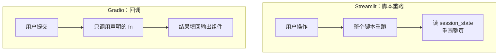

# 第 03 课　Streamlit 与 Gradio

上一课为了一个聊天页，HTML、CSS、JS 写了几十行。可我们的主战场是 AI，不是前端。有没有办法只写 Python 就有界面？有，而且是两种脑回路。

## 脑回路一：Streamlit——整个脚本重跑一遍

Streamlit 的世界观：你的 .py 文件就是界面本身。你每点一次按钮、每改一次输入框，Streamlit 把**整个脚本从头到尾重新执行一遍**，界面整体重画。

打个比方：像抄一本流水账，每次你改了一笔，就得从第一页重新抄到最新那页——省心，但重复劳动。跨交互的记忆靠 `st.session_state`：相当于每次重抄前，Streamlit 把你上次的草稿还到你手边。用 `@st.cache_data` / `@st.cache_resource` 装饰的代码则"抄到这页直接看缓存"，模型加载这种重活只干一次。

## 脑回路二：Gradio——声明"函数 + 输入 + 输出"

Gradio 的世界观：你写好一个函数，声明"输入是什么组件、输出是什么组件"，剩下的页面它全自动生成。像自动售货机：你只管按下按钮（输入），机器内部掉什么货（函数），取货口出什么（输出）——机器外观和按键布局是售货机公司（Gradio）的事。



## ui_demo.py：先看数据流，再上真界面

先跑零依赖版，把两种脑回路"打印"出来看：

```
python ui_demo.py
```

注意输出里的细节：Streamlit 式模拟里，"打字"那次没触发模型、点击才触发，而且第二次提问时第一次的问答还在——这就是"重跑但状态不丢"。Gradio 式模拟里则是一次提交对应一次回调。

然后是本章最爽的一步。装了 Streamlit 之后（缺库时脚本会打印中文提示并跳过真实界面段），**同一个文件**：

```
pip install streamlit
streamlit run ui_demo.py
```

还是那个 `model()` 函数，界面自己长出来了：输入框、按钮、聊天记录全都有——因为我们提前在文件里用 Streamlit 写好了界面代码，`streamlit run` 时自动切换进去。这就是"几乎不写前端"的含金量。

Gradio 版十几行，`ui_demo.py` 里也备好了（装好后运行 `python ui_demo.py --gradio`，或取消注释 `launch_gradio()`）：

```python
import gradio as gr   # pip install gradio

demo = gr.Interface(
    fn=你的函数,
    inputs=[gr.Textbox(label="问题"), gr.Slider(0, 1, 0.7, label="温度")],
    outputs=gr.Textbox(label="回答"),
    title="迷你问答机器人")
demo.launch()
```

## 两者怎么选

| | Streamlit | Gradio |
|---|---|---|
| 心智模型 | 脚本重跑 + session_state | 函数 + 组件声明 |
| 擅长 | 多步骤应用、Dashboard、带状态的小工具 | 模型演示页：拖张图、传段音频就能测 |
| 上手门槛 | 要理解"重跑"这套逻辑 | Interface 三件套几乎零概念 |

共同点：**原型和演示的利器**。等要产品化——多用户、登录、精细权限——就回到第 01/02 课的 FastAPI + 前端路线。判断标准很简单：给同事看效果，用这两个；给用户天天用，上 FastAPI。

## 想一想

1. Streamlit 里如果不用 `st.session_state`，用户点一次按钮后，上一次的聊天记录会怎样？为什么？
2. `@st.cache_resource` 为什么必须存在：模型加载要十秒，而脚本每次交互都重跑，不做缓存会发生什么？
3. 你刚训好一个图像分类模型，想让标注同事拖图进来快速试用，选 Streamlit 还是 Gradio？说出理由。
4. 轻动手：在 `ui_demo.py` 的 `model()` 里加一条你自己的问答，重跑零依赖模拟，再想想它会不会自动出现在 Streamlit 界面里。

## 小结

Streamlit 把脚本当界面，交互一次重跑一次，状态靠 session_state 和缓存兜住。Gradio 声明函数和组件，页面自动生成，最适合模型演示。两者都让我们跳过前端，把精力留在 AI 逻辑上；原型用它们，产品化回到 FastAPI。

界面会了，功能越加越多，主文件开始膨胀成"什么都有"的一坨。下一课用插件系统解决这个问题——让应用像乐高一样，功能模块随手插拔。

2026 年 10 月
