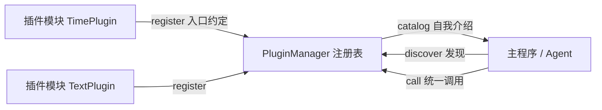

# 第 04 课　AI 插件系统

前三课的功能都挤在一个文件里还好。可当应用要接十几个功能——查时间、算字数、判情绪、连数据库、调搜索——全塞进主程序会怎样？改一个小函数碰坏大功能；同事想给你加个功能，得读懂你全部代码。这就像把所有电器都焊死在一块电路板上，坏一个灯泡得换整块板。

换一种做法：**USB 接口**。设备千差万别——键盘、硬盘、小风扇——但插口约定统一，任何设备即插即用，主电脑完全不用为它改造。插件系统就是给 AI 应用装一排 USB 口。

## 三件套：注册、发现、调用

灵魂是**入口约定**：主程序不 import 具体插件、不关心它写在哪个文件，只要求每个插件模块提供 `register(manager)` 这一个入口。跑 `python plugin_demo.py`，边看输出边对照代码：

- **注册**：`@manager.register("名字", description="...")` 装饰器一行登记；`TimePlugin` 登记一个，`TextPlugin` 一口气登记两个
- **发现**：`manager.discover([TimePlugin, TextPlugin])`——按入口约定批量收编，插上新模块只需往列表里加一个名字
- **调用**：`manager.call("word_count", "文本")` 统一入口，内部查表 → 查开关 → 执行 → 出错给中文提示而不裸抛（一个插件崩溃不能拖垮主程序）
- **自我介绍**：`manager.catalog()` 返回清单——上层靠它知道"我现在能用什么"
- **开关**：`disable("sentiment")` 之后调用直接被挡下，`enable` 又恢复——热插拔

自检：`python plugin_demo.py --selftest` 自动验证注册-发现-调用-开关-容错全链路。

## 它和 MCP 是一回事吗

第 6 章讲过 MCP（模型上下文协议），如今已是 AI 工具接入的行业标准。思想同源：统一入口、自我描述、动态发现。区别在规模——MCP 把这套约定升级成了跨进程、跨语言的协议，工具可以住在别人电脑上、用别的语言写；今天手写的 `PluginManager` 是它的最小精神原型。先亲手造过一次，协议对你就不是黑盒。

## 收束：现在，回第 12 章给项目穿衣服

还记得吗：第 12 章实战项目交付的都是"命令行素颜版"，因为当时界面技能你还没学。现在四课齐了，回去补妆——

| 第 12 章项目 | 现在能穿的"衣服" | 用哪课 |
|---|---|---|
| 12.1 本地知识库 RAG | Streamlit 页：输入问题→显示答案和出处 | 第 03 课 |
| 12.2 Agent 任务执行系统 | FastAPI 接口 + 执行日志流式推送 | 第 01/02 课 |
| 12.3 智能客服机器人 | 聊天网页：连续对话、逐字回复 | 第 02 课 |
| 12.4 监控 Dashboard | Streamlit 面板读报告 JSON，指标变图 | 第 03 课 |
| 12.7 企业 AI 助手 | 完整聊天应用 + 工具插件化 | 第 02/04 课 |

手法完全一样：把项目里的核心函数当成第 01 课那个 `fake_model` 接到界面上，业务逻辑一行不改。改完你会发现——讲义里学的"最小示例"和真实项目之间，只隔一次复制粘贴的距离。

## 想一想

1. `call()` 里为什么要用 try/except 包住插件执行？不包的话，一个插件出 bug 会连累谁？
2. `catalog()` 返回的清单，在 Agent 系统里对应什么？LLM 是靠它决定"用哪个工具"的吗？
3. 想给现有系统加一个"翻译插件"，需要改动主程序代码吗？你的插件文件需要满足什么约定？
4. 轻动手：照 `TextPlugin` 的样子写一个 `NumberPlugin`（插件名 `double`，输入数字字符串，返回翻倍结果），注册进 manager 并调用验证。

## 小结

插件系统三件套：注册、发现、调用，靠一个入口约定把"加功能"变成"插上去"。统一的 call 入口让主程序与插件互相隔离，出错不影响全局。这套思想与 MCP 一脉相承，是 Agent 工具体系的原型。到这里，全书主线收束：模型（第 2 章）、调用（第 3 章）、编排（第 4 章）、RAG（第 5 章）、Agent（第 6 章）、工程化（第 10~13 章）、界面与扩展（本章）——你已经能独立做出一个可演示、可扩展的 AI 应用。回第 12 章，给你最喜欢的项目穿上界面这件衣服，然后堂堂正正写进简历。

2026 年 10 月
