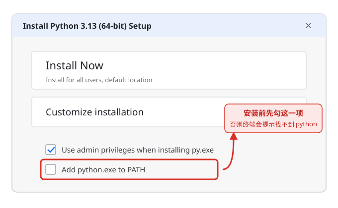
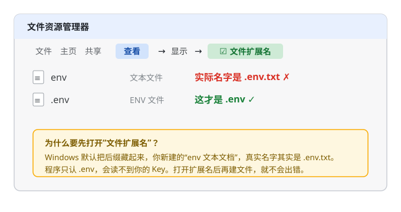

# 新手使用指南（写给完全没接触过编程的你）

> 本指南回答一个问题：**一个不会 IT 的人，要用这套教程学 AI Agent 开发，需要准备什么？**
> 建议先通读本指南，再按第 1 章开始学习。

---

## 一、这个项目适合新手吗？

**适合，但要按顺序来。** 本项目 14 章是从"零基础"到"AI 应用工程师"的完整路径，第一章已改写为零基础友好的纯 Python 入门。上手前你需要准备的东西分三类：

| 类别 | 需要什么 | 花费 |
|------|----------|------|
| 硬件 | 一台普通电脑（Windows/macOS 均可，8G 内存以上） | 无需 GPU！本书所有示例在 CPU 上可跑；少量本地模型部署章节建议有 N 卡，跳过不影响主线 |
| 软件 | Python 3.12+、VS Code（第 1 章手把手教装） | 免费 |
| 账号 | 一个 LLM API Key（第 3 章开始所有实战必需） | 按用量付费，学习期一般 ¥20-100 足够 |

---

## 二、环境准备四步（学习第 1 章前可以先跳过，第 1 章会教）

1. **安装 Python 3.12 或 3.13**：官网 <https://www.python.org/downloads/> 下载，安装时**务必勾选 "Add Python to PATH"**
2. **安装 VS Code**：<https://code.visualstudio.com/>，再装微软官方 Python 扩展
3. **每个项目建虚拟环境**：`python -m venv venv`（什么是虚拟环境？第 1 章第 09 课会讲）
4. **跑一次自检**：`python check_env.py`，看到「[OK]」即就绪

> Windows 用户注意：终端里的复制粘贴用右键或 Ctrl+Shift+V；`python` 和 `python3` 在 Windows 下通常同一个，macOS 下用 `python3`。

### 两个最容易踩的坑（对照下图操作）

**坑 1：安装 Python 时，先勾上 PATH**



- 这个勾选框在安装窗口的**最下面一行**，英文原文是 `Add python.exe to PATH`，点「Install Now」之前先把它勾上。
- 漏了会怎样：装好后在终端输入 `python`，会提示「不是内部或外部命令」，只能重装补勾。

**坑 2：建 `.env` 之前，先打开「文件扩展名」**



- 打开任意一个文件夹，窗口顶部菜单点「查看」→「显示」→ 勾上「文件扩展名」（Windows 10/11 措辞略有差异，找带「扩展名」三个字的那一项）。
- 不开会怎样：你新建的 `.env`，真实名字其实是 `.env.txt`，程序只认 `.env`，会读不到你的 Key。看到文件确实叫 `.env`（类型显示为 ENV 文件）才算对。

---

## 三、术语速查表（看教程时随时回来查）

| 术语 | 大白话解释 |
|------|-----------|
| 解释器 | 运行 Python 代码的程序，装 Python 就是装它 |
| pip | Python 的"应用商店安装器"，一条命令装第三方库 |
| 虚拟环境（venv） | 给每个项目一个独立的"工具箱"，避免库版本打架 |
| REPL | 终端里输入 `python` 进入的"对话式"试验场 |
| API | 程序之间的"服务窗口"，你的代码通过它调用别人提供的能力 |
| API Key | 调用 AI 服务的"钥匙+账户"，相当于收费会员卡号 |
| base_url | 接口的门牌号：用国产模型时改成厂商地址，同一套代码就能连上不同的大模型 |
| LLM | 大语言模型（GPT、Claude、国产大模型等）的统称 |
| Token | LLM 计费和计量的最小文本单位，约等于 0.5-1.5 个汉字 |
| Embedding | 把文字变成一串数字（向量），让计算机能算"语义相似度" |
| RAG | 检索增强生成：先从资料里"查"，再让 AI "答"，回答更可靠 |
| Agent | 能自己规划步骤、调用工具完成任务的 AI 程序 |
| 库/包 | 别人写好的代码合集，`pip install 库名` 即可使用 |

---

## 四、API Key 申请与配置（新手最容易卡死的一关）

第 3 章起，所有可运行的实战代码都需要一个 LLM API Key。

### 先用免费额度跑通第一次（推荐，约 5 分钟、0 花费）

我们用 DeepSeek 示范：注册就送免费额度，而且它和 OpenAI 用同一套协议，后面换别的厂商几乎只要改个地址。

**第 1 步**　打开 DeepSeek 开放平台 <https://platform.deepseek.com>，用手机号注册（新用户送免费额度）。

**第 2 步**　左侧菜单找到「API keys」，点「创建 API key」，起个名字，创建后**立刻复制保存**——这串字符只显示这一次。

**第 3 步**　在项目根目录新建一个文本文件，名字严格写成 `.env`（前面有一个点、没有其他后缀），贴入下面两行，等号后面换成你刚复制的 Key：

```text
OPENAI_API_KEY=粘贴你刚复制的Key
OPENAI_BASE_URL=https://api.deepseek.com
```

说明：因为 DeepSeek 用的是 OpenAI 兼容协议，变量名仍叫 `OPENAI_API_KEY`；第二行把门牌号指向 DeepSeek。

**第 4 步**　终端里安装两个库：

```bash
pip install openai python-dotenv
```

**第 5 步**　新建文件 `first_try.py`，贴入：

```python
from dotenv import load_dotenv
load_dotenv()          # 先把 .env 里的配置读进环境变量

from openai import OpenAI
client = OpenAI()      # 会自动读取 Key 和 base_url

resp = client.chat.completions.create(
    model="deepseek-chat",   # 模型名可能更新，以 DeepSeek 官网为准
    messages=[{"role": "user", "content": "用一句话介绍你自己"}],
)
print(resp.choices[0].message.content)
```

**第 6 步**　运行 `python first_try.py`，看到它打印出一句话——成功了！这就是后面所有章节在做的事，只是提示词更长、还会配上工具和知识库。跑完再执行 `python check_env.py`，它会认出你在用 DeepSeek。

> 报错速查：401 多半是 Key 或 base_url 没填对；提示模型不存在，就回 DeepSeek 官网核对模型名；其它报错看本指南第六节。

跑通这一遍，下面的通用流程你其实已经走过了；想换厂商或了解更多，可继续往下看：

1. **选一家服务商**：
   - 国内：DeepSeek、智谱 GLM、通义千问、月之暗面 Kimi（注册即送少量额度，支持支付宝/微信充值）
   - 国外：OpenAI、Anthropic（需要国际支付方式与网络条件）
2. **申请**：注册官网 → 控制台找到 "API Keys" → 新建 Key → **立刻复制保存**（只显示一次）
3. **使用**（三种方式，教程示例用第 1 种）：
   ```bash
   # 方式1：写在项目根目录 .env 文件里（记得把 .env 加进 .gitignore，别上传！）
   OPENAI_API_KEY=sk-xxxxxxxxxxxx
   # 方式2：终端临时设置
   # Windows (PowerShell):  $env:OPENAI_API_KEY="sk-xxx"
   # macOS/Linux:           export OPENAI_API_KEY=sk-xxx
   # 方式3：直接写在代码里（仅本地试验，切勿提交到 git）
   ```
4. **成本控制**：新手期用 `mini`/`flash` 级别的便宜模型；在服务商控制台设置**每月消费上限**；学习期总花费通常不超过一杯奶茶钱

---

## 五、逐章难度地图（零基础视角）

| 章 | 内容 | 难度 | 前置 | 新手建议 |
|----|------|------|------|----------|
| 1 | Python 入门 | ⭐ | 无 | 必修，边看边敲每段代码 |
| 2 | AI 底层基础 | ⭐⭐⭐ | 第1章 | 数学推导看不懂可先记结论，日后回补 |
| 3 | LLM 工程基础 | ⭐⭐ | 第1章 + API Key | 必修，AI 应用的"地基" |
| 4 | LangChain 框架 | ⭐⭐⭐ | 第3章 | 跟着示例敲，先会用再理解原理 |
| 5 | RAG 系统 | ⭐⭐⭐⭐ | 第2/4章 | 重点章，建议学完就做 12.1 项目 |
| 6 | Agent 系统 | ⭐⭐⭐⭐ | 第4章 | 重点章，可搭配 12.2 实战 |
| 7-8 | 向量数据库 | ⭐⭐⭐ | 第2章 | 先学 7.1 FAISS / 8.1 Chroma，其余按需 |
| 9 | 数据处理 | ⭐⭐ | 第1章 | 可穿插学习 |
| 10 | 部署与推理优化 | ⭐⭐⭐⭐ | 第2章 | 无 GPU 可先读概念 |
| 11 | 工程化工具链 | ⭐⭐⭐ | 有项目经验后 | 建议做完第12章再回头看 |
| 12 | 实战项目 | ⭐⭐⭐ | 第4-6章 | **最能涨信心的一章，完整代码可跑** |
| 13-14 | 架构设计/应用开发 | ⭐⭐⭐ | 全书 | 通读建立全局观即可 |

**推荐节奏**：零基础全职学习约 2-3 个月走完主线（1→3→4→5→6→12.1），在职学习拉长到 4-6 个月很正常。

---

## 六、常见卡点 FAQ

| 症状 | 原因与解决 |
|------|-----------|
| `'python' 不是内部或外部命令` | 安装时没勾 Add to PATH，重装勾选（详见第 1 章第 01 课） |
| `ModuleNotFoundError: No module named 'xxx'` | 库没装或装到了别的环境：先激活 venv，再 `python -m pip install xxx` |
| pip 安装很慢/超时 | 用清华镜像：`pip config set global.index-url https://pypi.tuna.tsinghua.edu.cn/simple`（详见第 1 章第 09 课） |
| 调 API 报 401/invalid key | Key 复制错了或没生效；检查 `.env` 位置与变量名拼写 |
| 调 API 报 429/insufficient | 额度用完或触发限流：充值或换 mini 级模型 |
| 中文输出乱码 | 用 Windows Terminal；或先执行 `chcp 65001` |
| 代码一模一样却报错 | 90% 是缩进问题：统一用 4 个空格，别混用 Tab |
| 教程版本和库对不上 | 每章开头有版本标注；AI 库更新快，以官方文档为准，报错信息直接搜原文 |

---

## 七、新手配套清单（完成情况）

1. **【已完成】根目录 `requirements.txt`**：全书依赖汇总，只给最低版本，按需安装、别一次全装
2. **【已完成】各课文件头"依赖说明"**：每个 `.py` 头部注明该课的 `pip install ...`
3. **【已完成】课末练习与想一想**：第 1 章配 `exercises/` 练习与参考答案；其余各课讲义内含「想一想」和课后练习
4. **【已完成】一键环境脚本**：`setup.bat`（Windows）/ `setup.sh`（Mac/Linux）+ 根目录 `check_env.py` 环境自检
5. **【已支持】国产模型**：`check_env.py` 可识别 DeepSeek/智谱/通义/Kimi 的 Key；本章「零成本第一次调用」以 DeepSeek 完整示范，其它厂商改 `OPENAI_BASE_URL` 即可

---

**更新时间**：2026年10月
